# CS61B 二叉搜索树的改进：B 树 笔记

---

> 笔记的来源：[CS 61B-2024 春季的课程](https://sp24.datastructur.es/)
> 课程主要内容：数据结构与算法分析
> 课程运用语言：Java

你可以在[我的笔记网站](https://notes.lavachen.org)里获得更多有用的资源。

这个课有[**6 个 Homework，10 个 Lab，9 个 Project**](https://github.com/Berkeley-CS61B/skeleton-sp24)。其中第一个 project 是一个完整的 2024 游戏的实现，很有意思。**此文章对应的是课程 17 节的内容。主要讲述 B 树的实现**

此笔记对应资源：[CS 61B 课本资源](https://cs61b-2.gitbook.io/cs61b-textbook/17.-b-trees/17.1-bst-performance)

## 1. BST 性能分析

对于 BST 一个缺点是：他的复杂度有可能从 O(logn) 变成 O(n)。
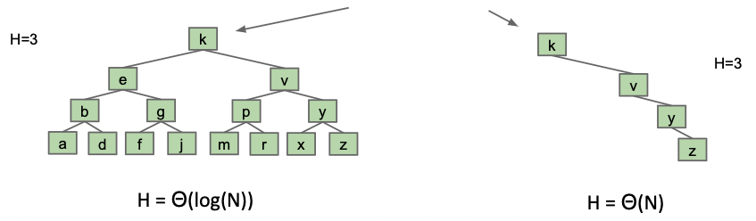

从中 我们可以回顾一下大 O 和大 Theta 的差别在哪。
对于二叉搜索树，

1. 最差的情况，树的高度为$$\Theta(n)$$
2. BST 的高度为$$O(n)$$
3. BST 的高度为$$O(n^2)$$

这些表述都是对的，因为 O 表示的是一个上限。
那为什么需要 O 呢，这里就需要用了，因为情况有可能从$$\Theta(N)$$变成$$\Theta(logN)$$,所以用 O 表示会合理一些。

## 2. 介绍 B 树

B 树是一种对 BST 的改进，它是一种平衡的多叉树。它可以解决 BST 的复杂度变成$$\Theta(N)$$的问题

### 2.1 BST 的高度和深度

BST 的高度和深度的计算方法是不同的。
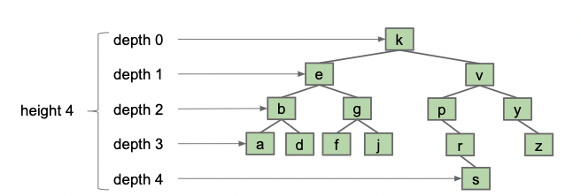

-   高度：树的高度是指从根节点到最远叶子节点的最长路径上的节点数。为树范围的属性
-   深度：树的深度是指根节点到最近叶子节点的路径上的节点数。

树的**平均深度**是每个节点深度的平均值。

### 2.2 B 树的插入

比较主要的是 B 树对于节点插入的处理。我们接下来看看一系列插入流程以理解 B 树的插入方法。

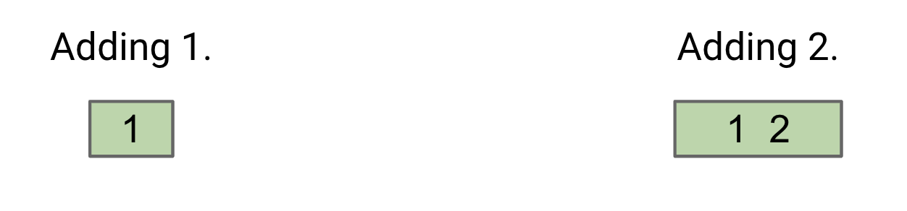

1. 我们在加入节点的时候首先考虑的是和并进原有节点当中。但如果超过了两个元素在一个节点里，我们就需要做出改变了，如下：

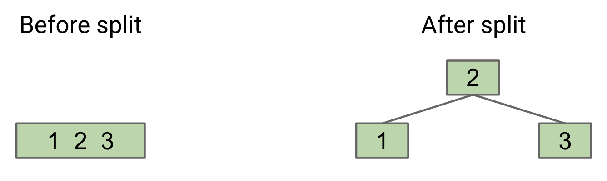

2. 我们选择将第二个加入的节点上移，然后分开这个节点。接着我们重复这个操作。

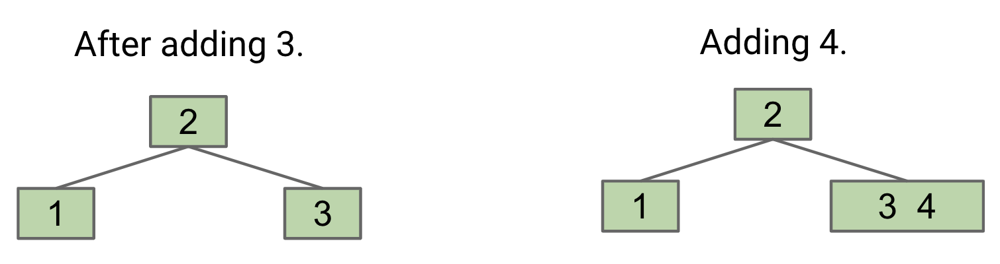
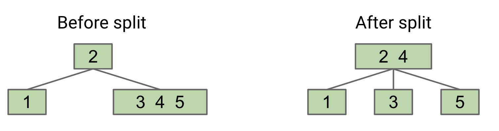
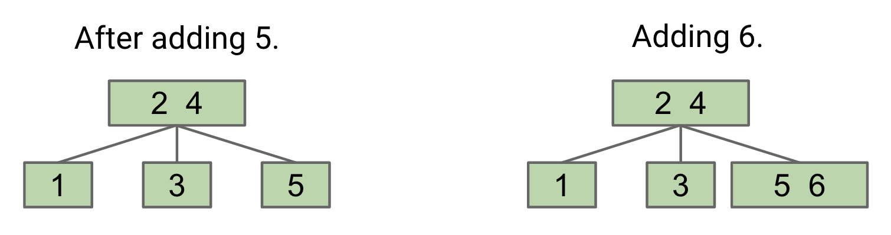

3. 接下来就产生问题了，如果我们再次上移节点，父节点也会超过两个元素，所以我们需要继续分裂父节点。我们的操作是将父节点分裂成两个节点，然后将第二个节点上移，分裂父节点，如此往复。

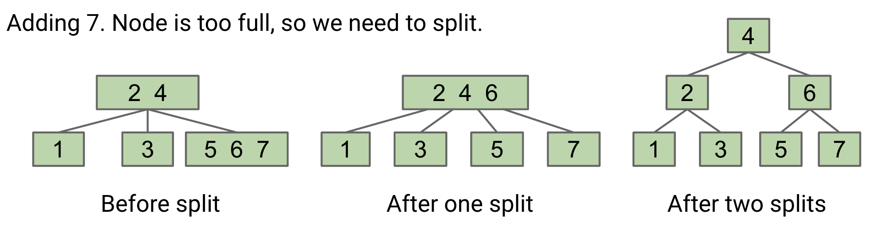

这就是 B 树的假如节点操作，可以尽可能的将复杂度控制在$$\Theta(logN)$$。因为他在平均分配节点，使得平均深度尽可能的小。这里的节点中元素个数是可以改变的，这里控制的是两个元素的节点。可以被称之为 2-3 树。

B 树的特性之一便是**任何一个末端子节点到父节点的距离是一样的**，这使得 B 树的高度和深度都可以被控制在$$\Theta(logN)$$。这玩意是 1972 年被发明的。整个算法的核心在于平衡，即不断从父节点去控制子节点的平衡性。

### 2.3 B 树的删除

B 树的删除操作也比较复杂。我们先来看看删除节点的流程。

如果我们要删除的节点有两个以上的子节点，我们需要将它和一个继承者交换，然后再删除它，这个继承者必须是末端的子节点。如下图中，我们要删除 17，则先将 18 交换到 17，然后删除 17。

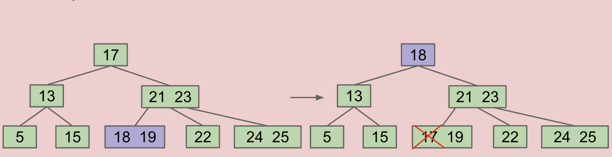

其次要考虑的问题就是，我们这里是 2-3 树，但有可能会用到节点容量更大的树，比如说这个：
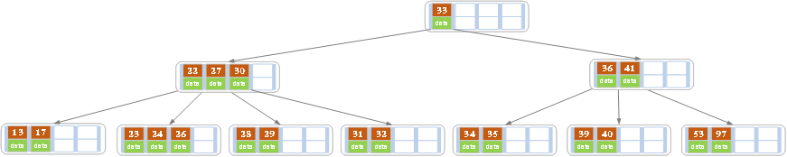
我们想要删除 27，那么先讲 27 和 28 交换，再删除 27，结果是这样的：
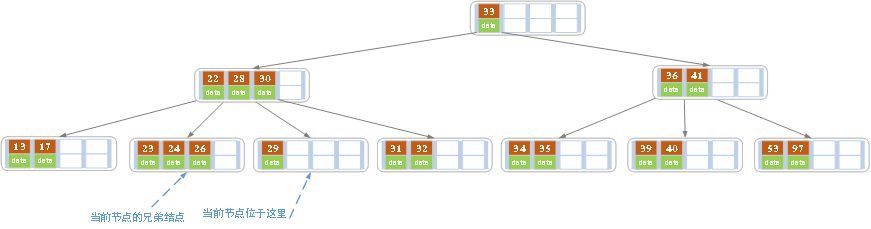
这样导致 29 的那个几点钟直邮一个元素，很浪费空间，所以我们将 29 和其他子节点进行平衡：
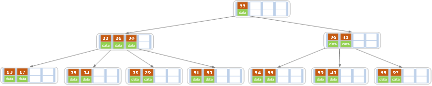

这就是 B 树的删除操作

## 总结

B 树是一种对 BST 的改进，它是一种平衡的多叉树。它可以解决 BST 的复杂度变成$$\Theta(N)$$的问题。B 树的插入和删除操作都可以被控制在$$\Theta(logN)$$。
