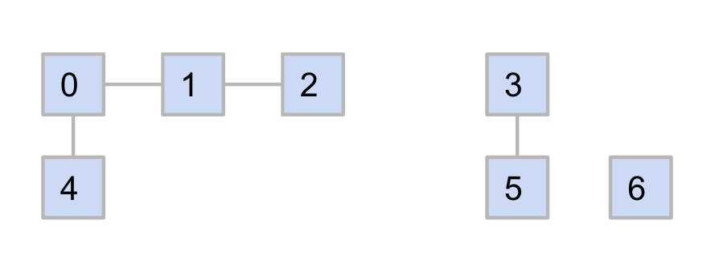
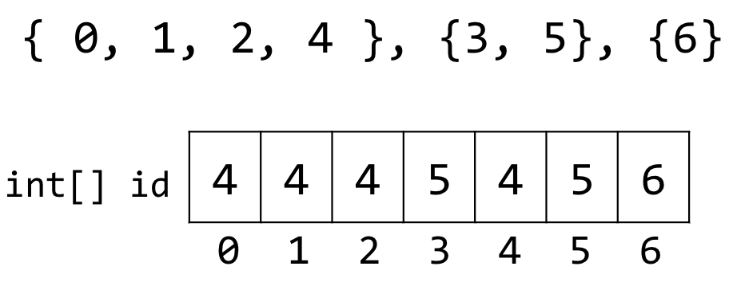
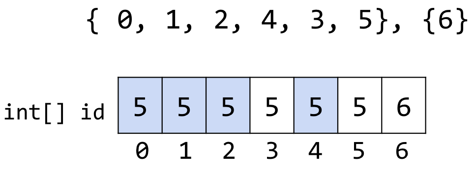
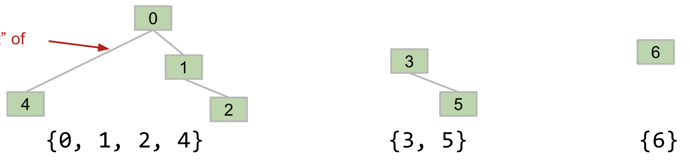
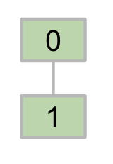
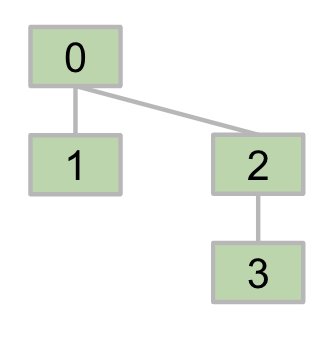
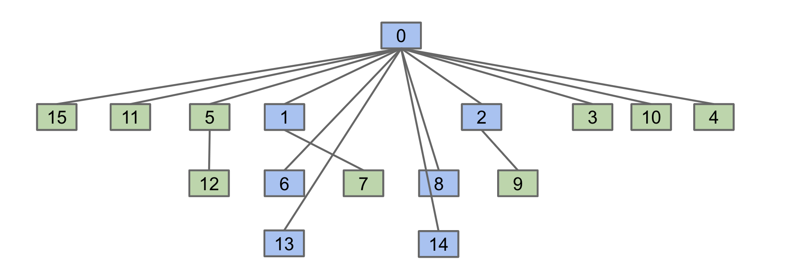

# 不相交集

---

> 笔记的来源：[CS 61B-2024 春季的课程](https://sp24.datastructur.es/)
> 课程主要内容：数据结构与算法分析
> 课程运用语言：Java

你可以在[我的笔记网站](https://lavachen.gitbook.io/lava-note)里获得更多有用的资源。

这个课有[**6 个 Homework，10 个 Lab，9 个 Project**](https://github.com/Berkeley-CS61B/skeleton-sp24)。其中第一个 project 是一个完整的 2024 游戏的实现，很有意思。**此文章对应的是课程 14 节的内容。主要讲述了一个不相交集的问题**

## 不相交集问题


我们可以用下面的代码描述上图元素的互相关系

```java
ds = DisjointSets(7)
ds.connect(0, 1)
ds.connect(1, 2)
ds.connect(0, 4)
ds.connect(3, 5)
ds.isConnected(2, 4): true
ds.isConnected(3, 0): false
```

而不相交集的问题就是实现`ds`的方法,我们要实现的是：

```java
public class DisjointSets {
    void connect(int a, int b) {}
    boolean isConnected(int a, int b) {}
}
```

## 实现方法

### 集合列表

一开始我们有`[{1},{2},{3},{4},{5},{6}]`
对于连接操作，我们可以将`a`和`b`所在的集合合并，即`[{1,2,3,4,5,6}]`

```java
void connect(int a, int b) {
    int setA = find(a);
    int setB = find(b);
    if (setA!= setB) {
        sets[setA].addAll(sets[setB]);
        sets.remove(setB);
    }
}
```

最后我们得到的算法性能为:

| 方法     | 初始化         | 连接     | 查询     |
| -------- | -------------- | -------- | -------- |
| 集合列表 | $$\Theta (N)$$ | $$O(N)$$ | $$O(N)$$ |

对于这个结果我们并不满意

### 快速查找

我们将给每一个元素分配一个标识符，这个标识符表示它所属的集合。

如果合并两个集合，就变成这样:


代码实现则是这样的：

```java
public boolean isConnected(int p, int q) {
        return id[p] == id[q];
	}

public void connect(int p, int q) {
    int pid = id[p];
    int qid = id[q];
    for (int i = 0; i < id.length; i++) {
        if (id[i] == pid) {
            id[i] = qid;
        }
    }
}
```

这个算法的性能如下：

| 方法     | 初始化         | 连接           | 查询     |
| -------- | -------------- | -------------- | -------- |
| 集合列表 | $$\Theta (N)$$ | $$O(N)$$       | $$O(N)$$ |
| 快速查找 | $$O(N)$$       | $$\Theta (N)$$ | $$O(1)$$ |

### 快速合并

我们已经通过给元素加标识的方法简化了查询操作的算法，接下来我们要利用树的方法来简化连接操作的算法。



如上图的这个结构，我们可以大概了解这个结构的实现。每当我们将两个元素连接的时候，我们将两个元素的根节点互相连接，就可以实现两个集合的合并。上述情况我们可以得到下表：

| element | 0   | 1   | 2   | 3   | 4   | 5   | 6   |
| ------- | --- | --- | --- | --- | --- | --- | --- |
| parent  | -1  | 0   | 1   | -1  | 0   | 3   | -1  |

其中，作为根节点的元素的父节点为-1。接下来我们用代码实现：

```java
public class QuickUnionDS implements DisjointSets {
	private int[] parent;

	public QuickUnionDS(int N) {
        parent = new int[N];
        for (int i = 0; i < N; i++){  parent[i] = -1; }
    }

  	private int find(int p) {
        int r = p;
        while (parent[r] >= 0){ r = parent[r]; }
       	return r;
    }
    public boolean isConnected(int p, int q) {
	    return find(p) == find(q);
    }

    public void connect(int p, int q) {
        int i = find(p);
        int j = find(q);
        parent[i] = j;
    }

...
}
```

### 权重

在上面的方法中，有一个问题在于我们直接使用了`parent[i] = j;`，并没有仔细考虑是将谁做为父节点。这里主要考虑的问题在于，如果一个一个树的层数太多的话，再加到另外一个树的下面，会导致层数变得更多。而层数的增加会导致查找操作的复杂度增加。所以我们在合并的时候需要考虑权重的问题。


我们采用第二个做法：**即将总节点数小的数，加到总节点数大的数的下面。**

接下来我们思考一个有意思的问题，即树的高度的最小值是多少？进一步阐述这个问题，即为了使 tree 的高度加一，并且我们利用的方法要是权重快速连接，我们最少需要多少个元素？

我们从一个简单的情况开始看起：

我们有一个高度为 1 的树（高度不包含父节点），其中包含 2 个元素（这是建立高度为 1 的树的最小元素数）。现在我们要通过连接另外一个树使得生成的树的总高度加一，我们的方法是再加一个高度为宜的树进去，并且该树的大小要小于等于 2（权重条件）。那么答案显而易见了，我们只能加一个和一样的树进去，构造了高度为 2 的树。现在得到的树总元素个数为 4.


接下来我们可以用递推，或者叫数学归纳法的思想，去解决这个问题了。

我们如果想加一个高度为 k 的树到一个高度为 k 且元素个数控制在最小的树中，我们只能加这个树本身（形状上相同），所以我们可以得到这个问题的答案了。

这样的一个树的高度为$$log_2N$$

而这个算法的复杂度就是：$$O(log_2N)$$

### 权重连接的进阶

现在思考一个问题，**我们是希望树更高还是更矮？**当然是需要树更矮，因为树的高度越低，查找操作的复杂度越低。所以当我们在连接单个元素的时候，我们可以选择将其加入到树的父节点，这样可以使得树的高度更低。就像这样：


