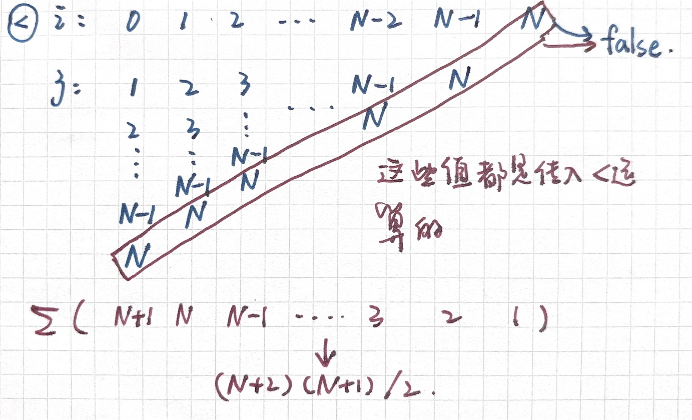

# Java 渐进论 1

---

> 笔记的来源：[CS 61B-2024 春季的课程](https://sp24.datastructur.es/)
> 课程主要内容：数据结构与算法分析
> 课程运用语言：Java

你可以在[我的笔记网站](https://lavachen.gitbook.io/lava-note)里获得更多有用的资源。

这个课有[**6 个 Homework，10 个 Lab，9 个 Project**](https://github.com/Berkeley-CS61B/skeleton-sp24)。其中第一个 project 是一个完整的 2024 游戏的实现，很有意思。**此文章对应的是课程 12 节的内容。主要讲述算法**

此笔记对应资源：[CS 61B 课本资源](https://cs61b-2.gitbook.io/cs61b-textbook/13.-asymptotics-i/13.1-an-introduction-to-asymptotic-analysis)

## 1. 高效的程序

高效的程序可以从两方面考虑：

1. **编程成本**
    1. 需要多长时间编写程序？
    2. 阅读修改代码是否容易？
    3. 程序的可维护性，扩展性如何？
2. **执行成本**
    1. 时间复杂度：你的程序执行需要多长时间？
    2. 空间复杂度：你的程序需要多少内存？

## 2. 判断数组是否有重复元素

为了理解接下的内容，我们考虑判断数组是否有重复元素的问题。

```java
List<Integer> example = [-3, -1, 2, 4, 4, 8, 10, 12];
```

**一种简单的算法 dup1**是比较每对元素。在上面的例子中，我们将列表中的每个元素与 -3 进行比较，然后与 -1、2 等进行比较。如果发现重复元素，则返回 true。

```java
public static boolean dup1(int[] A) {
  for (int i = 0; i < A.length; i += 1) {
    for (int j = i + 1; j < A.length; j += 1) {
      if (A[i] == A[j]) {
         return true;
      }
    }
  }
  return false;
}
```

**更好的算法 dup2**是利用列表的排序特性！将列表排序后，我们不必比较每对元素，而是可以将每个元素与其旁边的元素进行比较。

```java
public static boolean dup2(int[] A) {
  for (int i = 0; i < A.length - 1; i += 1) {
    if (A[i] == A[i + 1]) {
      return true;
    }
  }
  return false;
}
```

## 3. 算法性能表达

**1. 利用时间衡量**

-   使用物理秒表（不推荐）。

-   使用 Unix 的内置 time 命令。

-   使用具有类的普林斯顿标准库 stopwatch。

使用其中任何一种方法都会显示（具有不同精度级别，取决于是否选择了物理秒表路径），随着输入大小的增加，`dup1`需要更长的时间才能完成，而`dup2`完成速度相对大致相同。

这个方法看起来已经很好了，但它有许多缺陷。例如，如果输入数组非常大，则`dup1`可能会花费很长的时间来处理，而`dup2`则可能仍然很快。此外，时间能表达的信息太模糊不精准，所以我们需要寻找另一种方法。

**2.用操作次数来替代实际运行时间**

```java
for (int i = 0; i < A.length; i += 1) {
  for (int j = i+1; j < A.length; j += 1) {
    if (A[i] == A[j]) {
       return true;
    }
  }
}
return false;
```

对于每一个操作，我们可以记录它进行了多少次。假设数组的长度是 N（记得我们做的事计算数组哪是否有重复元素的问题）。这里绕了我一段时间，不过静下心来去列一下每一次运算的过程和 i，j 在运算时能取到的值，应该会很容易的理解。

| 操作     | 计数            | 解释                                                               |
| -------- | --------------- | ------------------------------------------------------------------ |
| i=0      | 1               | 需要初始化一次 i                                                   |
| j=i+1    | N               | 开始第二层循环时，j 都要初始化一次                                 |
| <        | (N² + 3N + 2)/2 | 详细解释见下                                                       |
| +=1      | (N² + N)/2      | 相比小于号，他每次循环的的计数要少一次，因为结束的总是在判断运算符 |
| ==       | (N² - N)/2      | 由于只在第二层循环内进行，每一次循环的次数比+=1 还要少一次         |
| 数组访问 | N²-N            | ==号两边各访问一次                                                 |

要计算小于运算进行了多少次，我们就要看有多少值会作为传入量传进这个运算当中：


**练习**

```java
for (int i = 0; i < A.length - 1; i += 1){
  if (A[i] == A[i + 1]) {
    return true;
  }
}
return false;
```

去计算每个运算的计数

<details>
<summary>查看答案</summary>

| 运算     | 计数 |
| -------- | ---- |
| i=0      | 1    |
| i+=1     | N-1  |
| <        | N-1  |
| ==       | N-1  |
| 数组访问 | 2N-2 |

</details>

## 4. 渐近现象

为了更好的衡量一个算法的性能，光是计算每个运算的计数是不够的，我们需要进一步的去简化这个性能的表达方式。


注意：我们的目标是比较算法性能，而不是量化算法的运行时间。


### 4.1 考虑最坏的情况

| 操作 | 计数       |
| ---- | ---------- |
| ==   | $$100N^2$$ |
| >    | $$N^3+1$$  |
| <    | 500        |

假如每个运算各自占用的时间是 a,b,c，那么算法的运行时间为：

$$
T(N) = 100aN^2 + b(N^3+1) + 500c
$$

当 N 趋于一个极大的值，N^3+1 的增长速度明显大于其他的运算。所以我们一般指考虑 N 幂级数最大的运算的计数。

### 4.2 忽略低阶项

忽略低阶项，只考虑最高阶项，即忽略常数项和低阶项。

### 4.3 忽略常数项

常数项在**比较的时候**并不会有太大的影响。

## 5. 大 theta 记号

我们通过上述的方法，可以将$$Q(N)$$转化为$$\Theta()$$。

| 函数                | 大$\Theta$记号 |
| ------------------- | -------------- |
| $$N^3+3N^4$$        | $$N^4$$        |
| $$N^3+\frac{1}{N}$$ | $$N^3$$        |
| $$Ne^N+N$$          | $$Ne^N$$       |

**更进一步了解**
假如有$$Q(N)=\Theta(f(N))$$,那么存在$$k_1,k_2$$使得有$$k_1f(N)<=Q(N)<=k_2f(N)$$。

## 6. 大 O 记号

它和大 theta 记号的区别在于只要满足$$Q(N)<=k_2f(N)$$
比如说$$Q(N)=N^3+3N^4$$,那么$$O(f(N))$$可以取到$$N^{10}$$都可以。
