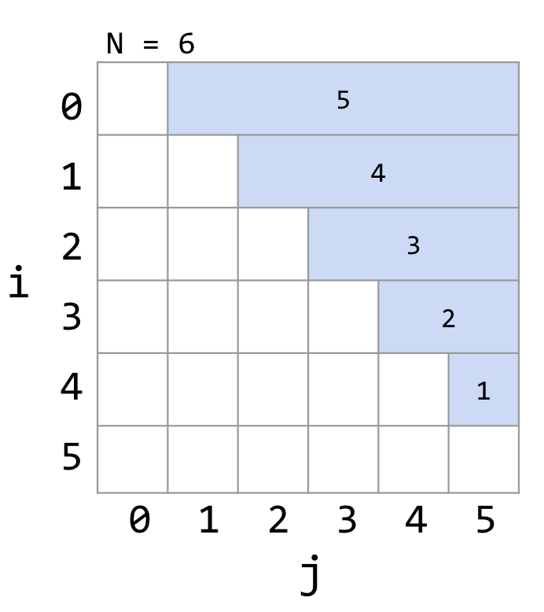
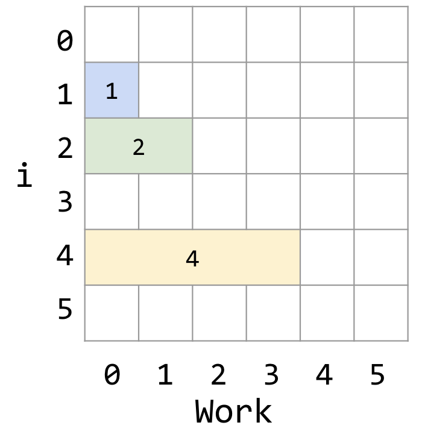
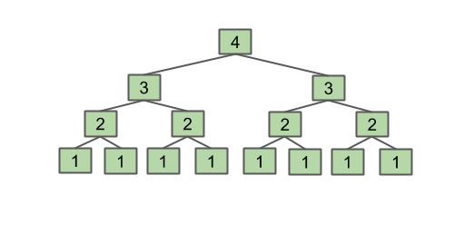
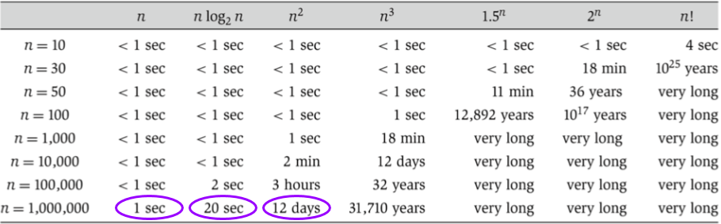

# CS61B 渐进分析 2

---

> 笔记的来源：[CS 61B-2024 春季的课程](https://sp24.datastructur.es/)
> 课程主要内容：数据结构与算法分析
> 课程运用语言：Java

你可以在[我的笔记网站](https://notes.lavachen.org)里获得更多有用的资源。

这个课有[**6 个 Homework，10 个 Lab，9 个 Project**](https://github.com/Berkeley-CS61B/skeleton-sp24)。其中第一个 project 是一个完整的 2024 游戏的实现，很有意思。**此文章对应的是课程 15 节的内容。主要讲述算法**

此笔记对应资源：[CS 61B 课本资源](https://cs61b-2.gitbook.io/cs61b-textbook/15.-asymptotics-ii/15.1-for-loops)

## 1. For 循环

**这一个笔记对应的课程主要讲的是如何去计算算法的复杂度。** 可以参考之前的笔记 CS61B 渐进分析 1.就比如说：

```java
int N = A.length;
for (int i = 0; i < N; i += 1)
   for (int j = i + 1; j < N; j += 1)
      if (A[i] == A[j])
         return true;
return false;
```

这个算法中==运算的复杂度是$$(N² - N)/2$$，复杂度为$$\Theta(N^2)$$,这一结果的推导过程可以去之前的笔记看一下。
总之，我们可以总结出两个方法去计算复杂度：

1. 直接计算次数
2. 几何可视化的方法

个人比较推荐第二种，个人属于视觉化的学习者，方便理解算法。就比如上述的算法，想计算==运算的次数可以列这样一张表：



可以看到输入==运算的(i,j)组合一共有多少个，从而计算出复杂度。

### 例子

```java
public static void printParty(int N) {
   for (int i = 1; i <= N; i = i * 2) {
      for (int j = 0; j < i; j += 1) {
         System.out.println("hello");
         int ZUG = 1 + 1;
      }
   }
}
```

用图表的方式将其画出来，就是这样的：

我们通过表格画出来当 N 变化的时候，总运算的次数：

| N    | 1   | 2   | 3   | 4   | 5   | 6   | 7   | 8   | 9   | 10  |
| ---- | --- | --- | --- | --- | --- | --- | --- | --- | --- | --- |
| C(N) | 1   | 3   | 3   | 7   | 7   | 7   | 7   | 15  | 15  | 15  |

接近于无穷的时候，我们制定一个数为$$N=2^n$$，那么，总运算次数为$$C(N) = 2^{n+1}-1=2N-1$$。所以复杂度为$$\Theta(N)$$.

## 2. 递归

递归算法的复杂度分析也是比较复杂的，但是我们可以从一个例子入手，来看看递归的复杂度。

```java
public static int f3(int n) {
   if (n <= 1)
      return 1;
   return f3(n-1) + f3(n-1);
}
```

我们通过一个树状图来表示这个算法的运行结构：

其实看了这张图后就可以计算出结果了，由于这是一个比较简单的示意，他的$$C(N)$$就是$$1+2+4+...+2^{n-1}=2^{n}-1$$，所以复杂度为$$\Theta(2^n)$$.

这用的是几何示意+代数的方法

## 3.二分查找

二分查找是在已经排列好的列表去找到制定元素的算法。就是不断通过用一段数据的中间值和制定元素进行比较，去判断制定元素的位置。那么我们该如何计算它的复杂度呢？

我们同样可以利用列表格的方法：

| N    | 1   | 2   | 3   | 4   | 5   | 6   | 7   | 8   | 9   | 10  |
| ---- | --- | --- | --- | --- | --- | --- | --- | --- | --- | --- |
| C(N) | 1   | 2   | 2   | 3   | 3   | 3   | 3   | 4   | 4   | 4   |

当 N 趋近于无穷大的时候，我们令$$N=2^n$$，那么，总运算次数为$$C(N) = n+1 = log_2(N)+1$$。所以复杂度为$$\Theta(logN)$$.

对数的复杂度是很好的，相当于常数级的复杂度。
我们可以看课程中举的例子，当输入量增加了**一万亿倍**，运行时间只增加了 7 倍。

## 4.归并排序

假设我们有两个排序数组，想要将它们合并为一个大的排序数组。我们可以将一个数组附加到另 ​​ 一个数组上，然后重新排序，但这并没有利用每个数组都已经排序的事实。我们如何利用这一点呢？

我们可以将两个表的开头进行比较，将最小的先放进去，就这样一直比较，直到两个数组都为空。然后再将剩下的元素合并到一个数组中。显而易见，这里的复杂度为$$\Theta(N)$$.

相比于**选择排序**好很多

> 选择排序
> 这里简要介绍一下选择排序，简单来说就是不断把一堆元素中最小的元素拿出来放到前面，由于要便利数组，所以他的复杂度是 N 的平方

我们可以利用归并排序的想法加上二分法的思想，来实现一个更加高效的排序算法。

-   如果列表大小为 1，则返回。否则：
-   对左半部分进行归并排序
-   对右半部分进行归并排序
-   合并结果

要计算这个算法的复杂度，可以考虑最糟糕的情况：
由于是二分，所以最多有$$log_2(N)$$层，每层需要进行一次合并，所以每层的复杂度为$$\Theta(N)$$，所以总复杂度为$$\Theta(NlogN)$$.

这个复杂度是很好的，相当于$$\Theta(N)$$,可以参考这个表格：


