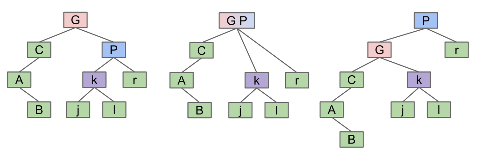
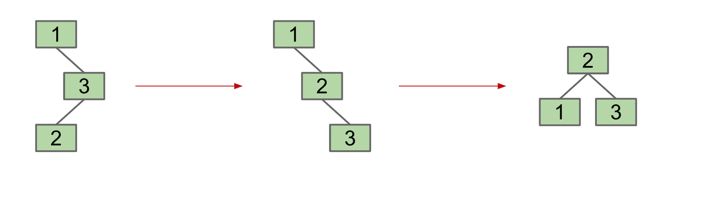
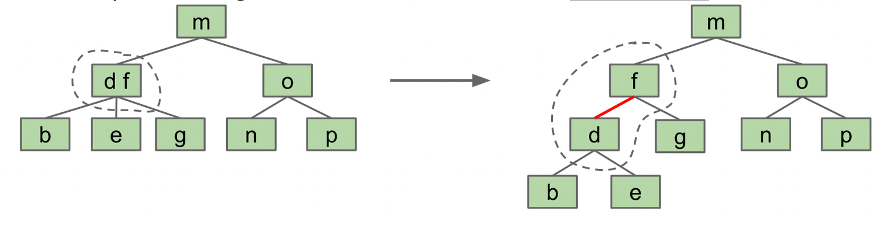
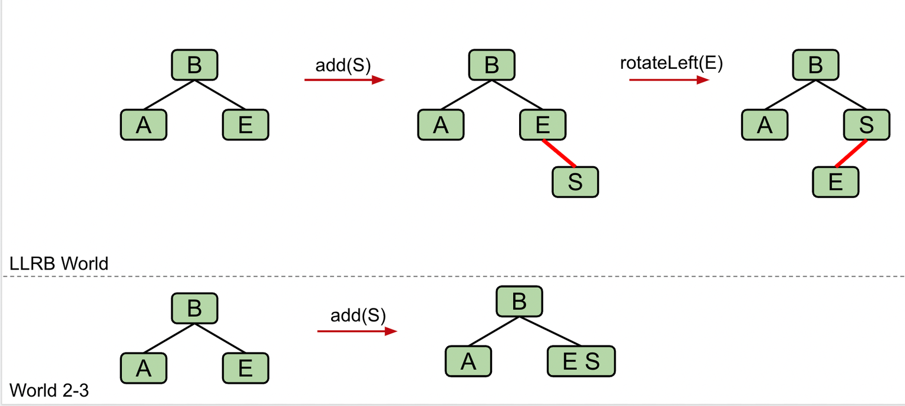
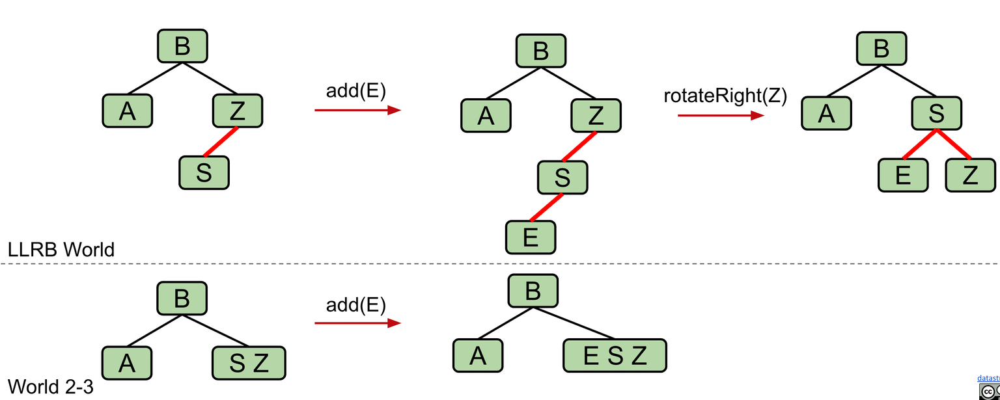
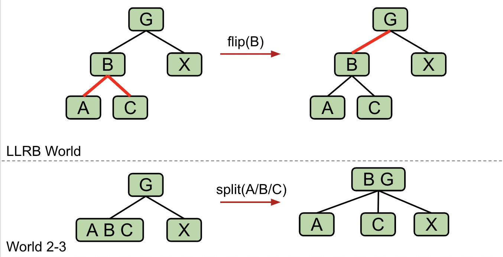

# CS61B 红黑树 笔记

---

> 笔记的来源：[CS 61B-2024 春季的课程](https://sp24.datastructur.es/)
> 课程主要内容：数据结构与算法分析
> 课程运用语言：Java

你可以在[我的笔记网站](https://notes.lavachen.org)里获得更多有用的资源。

这个课有[**6 个 Homework，10 个 Lab，9 个 Project**](https://github.com/Berkeley-CS61B/skeleton-sp24)。其中第一个 project 是一个完整的 2024 游戏的实现，很有意思。**此文章对应的是课程 17 节的内容。主要讲述 红黑旋转术的数据结构**

此笔记对应资源：[CS 61B 课本资源](https://cs61b-2.gitbook.io/cs61b-textbook/17.-b-trees/17.1-bst-performance)

## 1. 旋转树

B 树（上个笔记中）的问题在于它的实现比较困难，拆分过程比较复杂。所以我们尝试用另外一种方法去构建平衡树，用更简洁的方法。

**旋转的定义**

-   `rotateLeft(G)`:假设 G 节点有一个子节点 P,那么左旋的过程是调整树结构，使得 G 成为 P 的左子节点。
-   `rotateRight(G)`:假设 G 节点有一个子节点 P,那么右旋的过程是调整树结构，使得 G 成为 P 的右子节点。

这里用图表示了左旋的过程：


-   G 的右孩子 P 与 G 合并，并带着它的子孩子一起合并。

-   然后，P 将其左孩子传递给 G，G 向左向下移动成为 P 的左孩子。

```java
private Node rotateRight(Node g) {
    Node p = g.left;// 取出 G 的右孩子 P
    g.left = p.right;// 把p右边一坨放到g左边
    p.right = g;// 把g放到p的右边
    return p;
}

private Node rotateLeft(Node g) {
    Node p = g.right;
    g.right = p.left;
    p.left = g;
    return p;
}
```



我们用以下步骤使得树达到平衡：

1. `rotateRight(3)`
2. `rotateLeft(1)`

## 2. 创建左倾红黑树(LLRB)树

我们可以回忆一下 B 树的初衷，它是为了解决 BST 二叉搜索树不能达到平衡的问题。但 B 树实现困难，所以我们可不可以找到一种方法将两者优势结合起来呢？

我们可以用链接的方法去讲 B 树的节点拆开：

我们通过将链接设为红色来表明它是粘合链接。普通链接为黑色。因此，我们将这些结构称为**左倾红黑树** (LLRB)。这里使用左倾树。

## 3. 插入 LLRB 树

在 LLRB 树中插入时，我们总是将新节点插入到其父节点的**红色链接**中。这是因为在 2-3 树中，我们总是通过添加到叶节点来进行插入，我们添加的链接的颜色应该始终为红色。


我们在插入一个节点的时候，应该用什么颜色的链接来表示？红色的链接？黑色的链接？
我们应该用一个红色的链接。因为对应的 B 树草哦左中，我们总是将加入的值加在节点里


通常正常的插入是没有问题的，但是会出现这三种情况，使得插入并不顺利：

1. 插入导致右倾
   
   如图所示我们加入 S 节点的时候，导致了右倾，违反了我们的左倾规则，我们需要进行旋转操作。
2. 左侧双重插入
   
   如图，我们加入节点后，导致有两个连续的红色节点，违反了我们的左倾规则，我们需要进行旋转操作。使得一左一右的连接在一个节点上，这种情况正好对应上了第三种情况。
3. 节点有两个红色子节点
   
   对于这种情况，我们翻转节点的链接的颜色，从而满足左倾规则。

## 4.总结

在过去的 3 个笔记中，我们讨论了如何使用搜索树来实现集合/映射。

-   二叉搜索树很简单，但它们容易失衡。
-   2-3 树 (B 树) 是平衡的，但实现起来很麻烦，而且速度相对较慢。
-   LLRB 插入很容易实现（但删除很难）。 通过使用 2-3 树保持数学双射来工作。
-   Java 的 TreeMap 是一棵红黑树（不是左倾）。
    -   与 2-3-4 树保持对应关系（不是 1-1 对应）。
    -   允许在任一侧进行粘合链接（参见红黑树）。
    -   实现更复杂，但速度明显更快（？）。

但是课程接下来直接开始介绍哈希，跳过了其他的树形数据结构。
