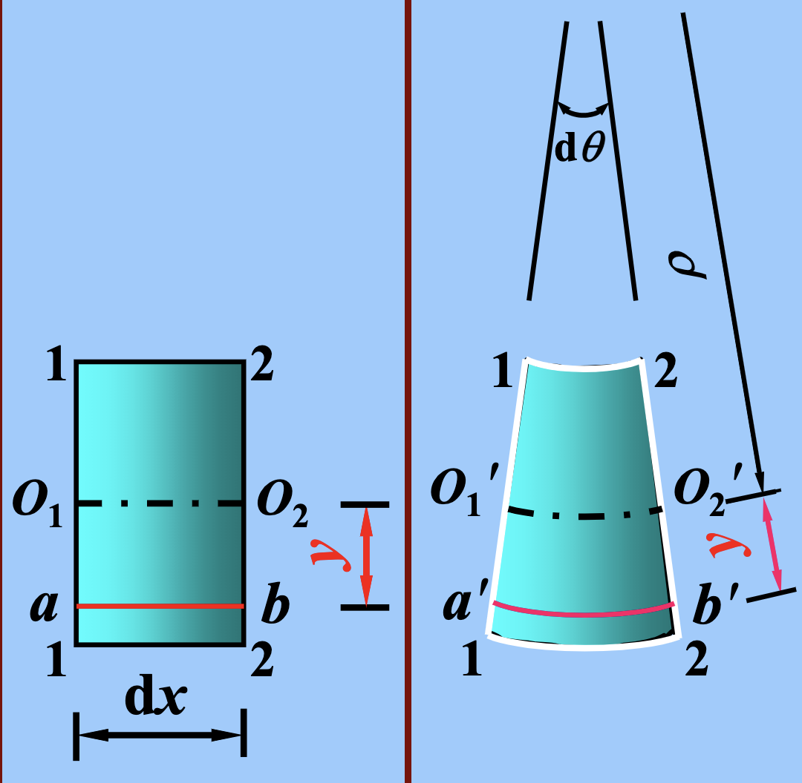
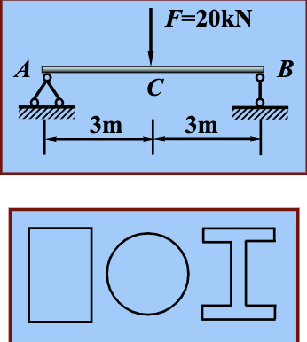

# 平面弯曲应力

## 梁横截面上的内力

---

-   剪力 $$F\_s \rightarrow \tau dA$$
-   弯矩 $$M \rightarrow \sigma dA$$

## 梁横截面上的正应力

---

### 1. 变形几何关系 📐

1. 纵线变为曲线，且梁上部纵线缩短，下部纵线伸长；
2. 横线仍为直线，但旋转了一个角度，并与弯曲后的纵线**正交**；
3. 纵线伸长区，梁的宽度减小；纵线缩短区，梁的宽度增大


**两个假设**

-   平面假设 变形后，横截面仍保持为平面，并和弯曲后的纵线正交
-   单向受力假设： 梁内各纵向线之间互不挤压，只承受单向拉伸或单向压缩
    

#### **中性层**

中间有一层纵线既不伸长，也不缩短，称为**中性层**。中性层与横截面的交线为中性轴

#### 线应变

$d\theta$ 1-1 和 2-2 截面的相对转角 $\rho$ 变形后中性层的曲率半径 $y$ 任一纵线到中性层的距离

ab 的线应变：

$$\epsilon=\frac{a'b'-ab}{ab}=\frac{(\rho+y)d\theta-\rho d\theta}{\rho d\theta}=\frac{y}{\rho}$$

### 2. 物理关系

在线弹性范围内 $$\sigma =E\epsilon = E\frac{y}{\rho}$$

正应力沿截面高度**线性分布**，沿截面宽度**均匀分布**， 中性轴上正应力为**零**。

### 3. 静力学关系

1. $$F_N=\int_A \sigma dA = 0 \rightarrow \int_A y dA = 0$$ 横截面对中性轴的面积矩等于零
2. $$M_y=\int_A z\sigma d A= 0 \rightarrow \int_A yz dA = 0$$
3. $$M_z=\int_A y\sigma d A= 0 \rightarrow \frac{E}{\rho} \int_A y^2 dA = 0 \rightarrow \frac{1}{\rho} =\frac{M}{EI_Z}\rightarrow \sigma = \frac{My}{I_Z}$$

$$EI_Z$$ 梁的弯曲刚度

**最大正应力**：$$\sigma_{max}=\frac{My_{max}}{I_z}$$

当中性轴为对称轴的时候，两端的应力为$$\sigma_{max}=\frac{My_{max}}{I_z}=\frac{M}{W_z}$$

其中可以看到有两项变量和材料有关，将其并为了$$W_z$$,这个称之为[**弯曲截面系数**](./wiki.md#弯曲截面系数)

## 正应力公式的推广 📝

对于横力弯曲，横截面上既有弯矩又有剪力，平面假设和纵向线之间互不挤压假设均不成立。但实验和理论分析表明，当 l /h（跨高比）较大（> 5）时，纯弯曲情况下导出的正应力公式可满足工程的精度要求。

---

##### 例 1

> 一简支梁及其所受荷载如图所示。若分别采用截面面积相同的矩形截面，圆形截面和工字形截面，试求三种截面的**最大拉应力**。设矩形截面高为 140mm，宽为 100mm。

中性轴为横截面的对称轴

$$M_{max}=\frac{1}{4}Fl=30kNm$$(两个支点分别承担)

1. 矩形截面：

$$I_z = \frac{1}{12}bh^3$$
$$W_z = \frac{I_z}{y_{max}} = \frac{1}{6}bh^2=36.7*10^4mm^3$$
$$\sigma_{max}=\frac{M_{max}}{W_z}=91.8MPa$$

2. 圆形截面：

$$\frac{1}{4}\pi d^2=bh$$
$$I_z = \frac{1}{32}d^4$$
$$\sigma_{max}=\frac{M_{max}}{W_z}=128.4MPa$$

3. 工字形截面：

查型钢表得数据
$$\sigma = \frac{M_{max}}{W_z}=14.4Mpa$$

工字形截面最经济合理

---

##### 例 2

> 一 T 形截面外伸梁及其所受荷载如图所示。求最大拉应力及最大压应力，并画出最大拉应力截面的正应力分布图。

1. 确定横截面形心的位置

2. 计算横截面的惯性矩

$$I_z = \int_A \rho^2 dA$$
