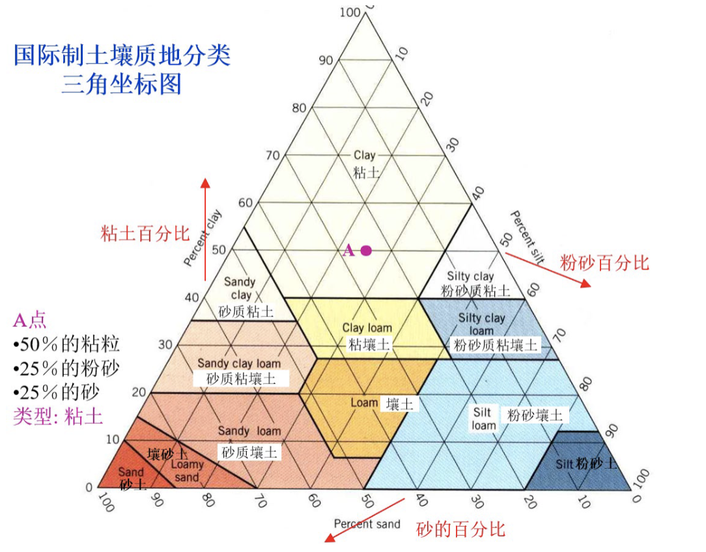

# 土壤

## 1. 土壤圈的物质组成

### 1.1 土壤

> 土壤是地球陆地上能够生产植物收获物的疏松表层。

**土壤和土地的区别**

-   土壤：是地球表面能够生长绿色植物的疏松层次。
-   土地：是地球表层的陆地及其附属部分。它包括：地球表层的河流、湖泊、沙漠、裸岩、居民点占地、交通占地、工矿占地等。
-   土地中包含着土壤，而土壤仅是土地中能够生长绿色植物的部分。

土壤的基本属性：具有**肥力**

> 土壤肥力(soil fertility)：指土壤为植物生长不断地供应和协调养分、水分、空气和热量的能力

-   土壤学中把水、肥、气、热——称为四大肥力因素
-   水、肥、气是**物质基础**,热是**能量条件**
-   任何一个土壤的肥力特征都是水,肥,气,热各肥力因素的综合反映.困难之处在于如何把它们量度和表达出来,这也是土壤学在现代化过程中需要努力的重要方向之一。

### 1.2 土壤圈

> 土壤圈是覆盖于地球表面和浅水域底部的土壤所构成的一种连续体或覆盖层，是大气圈、水圈、岩石圈、生物圈之间相互作用的产物

通常把地球表层系统中的大气圈、生物圈、岩石圈、水圈和土壤圈作为构成自然地理环境的五大要素

### 1.3 土壤的物质组成

-   固体土壤（50%）
    -   矿物质
    -   有机质
-   粒间孔隙（50%）
    -   土壤空气
    -   土壤水分
-   土壤生物体

#### 1.3.1 矿物质

土壤矿物的类型包括**原生矿物**和**次生矿物**。原生矿物就是化学组成和结晶结构没有发生变化的原始成岩矿物。而次生矿物包括三类：简单的盐类、次生氧化物、次生层状铝硅酸盐。他们在土壤中以粘粒形式存在。

#### 1.3.2 土壤有机质

#### 1.3.3 土壤水分

土壤水分是土壤的重要组成成分，是植物生活必需的生态因子，也是土壤生态系统中物质和能量的流动介质，存在于土壤孔隙中
**分类**

-   土壤水
    -   束缚水
        -   吸湿水
        -   膜状水
    -   自由水
        -   毛管水
        -   重力水

**a.吸湿水**

-   由于土壤表面张力所吸附的水汽分子
-   干土从空气中吸着水汽所保持的水
-   植物无效水

> 吸湿系数：干土从相对湿度接近饱和的空气中吸收水汽的最大量

**b.膜状水**

-   土粒**吸足了吸湿水**后，还有剩余的吸引力，可吸引一部分液态水成**水膜状附着在土粒表面**，这种水分称为膜状水
-   土壤膜状水达到最大值时的土壤含水量称为**土壤最大分子持水量**

> **凋萎系数**Wilting point：当植物产生永久凋萎时的土壤含水量。此时土壤水包括全部的吸湿水和部分膜状水
> 凋萎系数与土壤质地、有机质含量等因素有关。粘粒含量越多、有机质含量越高，凋萎系数越大

**c.毛管水**

毛管孔隙中靠毛管力吸附保存的水分

-   毛管上升水：指地下水位较高时，沿毛管上升而存在于土壤毛管孔隙中的水分
-   毛管悬着水：指与地下水无联系的存在于土壤毛管孔隙中的水分，来自降水、灌溉水或冰雪融水

> **田间持水量** field capacity：毛管悬着水达到最大时的土壤含水量
> 与土壤质地、有机质含量等因素有关

**d.重力水**

当土壤水分含量**超过田间持水量**时，在重力作用下，沿着土壤中的非毛管孔隙向下运动的多余水分

> **土壤饱和含水量** Saturated water content : 土壤所有孔隙都充满水时的含水量，也称为土壤全持水量

**土壤水分的有效性**
土壤水分的有效性指土壤水分能够**被植物吸收利用的难易程度**，不能被植物吸收利用的称无效水，能被植物吸收利用的称为有效水

-   土壤有效水分的下限为凋萎系数（萎蔫系数）
-   旱地土壤有效水分的上限为田间持水量
-   旱地土壤最大有效水分量 = 田间持水量 - 萎蔫系数


现有 A 和 B 两种质地类型的土壤（30cm 内土层），A 和 B 的凋萎系数分别为 14.7％，3.4％；田间持水量分别为 22.6％和 12.3%。

1. 已知这两种质地类型可能黏土和砂壤，根据土壤水分系数判断 A 和 B 分别是那种质地类型，并简单说明原因。
2. 计算 A、B 两种质地的有效水含量



**土壤含水量（湿度）的常用表示方法**

-   土壤质量含水量 Gravimetric soil water content
    -   指土壤中保持的水分质量占土壤质量的分数，单位 g/kg (也曾用重量含水量，以%表示)
        $$\theta_m = [(m_1-m_2)/m_2]*1000$$
-   土壤容积含水量 Volumetric soil water content
    -   指土壤水分容积与土壤容积之比，常用 $$θ_v$$ 表示
        $$θ_v = 土壤水分容积/土壤容积 *100%$$
-   土壤相对含水量 Relative soil water content
    -   土壤含水量与该土壤田间持水量的比值
        $$土壤相对含水量= （土壤含水量/土壤田间持水量） ×100%$$

**土壤含水量的测定**

1. 烘干法
    1. 经典烘干法：在 105-110 度下，烘至恒重
    2. 改进快速发：采用红外线或者微波
    3. 缺点：采样会干扰田间土壤水分的连续性，在田间会留下的取样孔，会切断作物的某些根并影响土壤水分运动
2. 中子土壤水分仪
    1. 通过测定反映慢中子云的密度与水分子间的函数关系,可以确定土壤含水量
    2. 不破坏土壤，可测量土壤深达 30 米的剖面含水量，但是不能用于表层土
3. 张力计式土壤水分传感器
    1. 通过安装在土壤中的张力计，测量土壤水的吸力，然后依据土壤水分特征曲线来换算成土壤含水量
4. 频域反射仪（FDR）：Frequency Domain Reflectometry
    1. 当土壤中的水分增加时，其介电常数相应增大，测量时电容式水分传感器给出的电容值也随之上升。根据这种关系测定土壤湿度
5. 时域反射仪（TDR）：Time Domain Reflectometry
    1. 根据土壤湿度与介电常数之间的关系，测量电磁脉冲从发射源发出后反射回来的时间，根据反射时间与发射源的距离，出发到返回所需时间以判断土壤含水量
    2. 测表层土壤
6. 卫星遥感
7. 探地雷达

#### 1.3.4 土壤空气

**来源和组成**

来源于大气。相比于大气，水汽和 CO2 的含量高，O2 低，N2 差不多。还含有 H2S,CH4,NH3,CO 等生化过程产生的气体。

**土壤与大气之间的气体交换**

气体交换主要是通过个别气体成分的浓度差异（分压梯度）导致的扩散

> **土壤呼吸作用**：由于土壤中的氧气浓度比大气低，二氧化碳浓度比大气高，因而，大气中的氧不断扩散进行土壤，而土壤中的二氧化碳不断向大气扩散，这种气体扩散交换机制称为土壤的呼吸作用

## 2.土壤圈的性质

### 2.1 土壤圈的物质性质

#### 2.1.1 颜色

土色测定的定量化可以用：芒赛尔土壤比色卡，中国标准土壤色卡。

-   **热带和亚热带土壤**：红色为主（ Fe 2 O3 赤铁矿多）,而在林下或多雨的山地上部，则颜色偏黄（ Fe 2 O3 · 3H2 O 褐铁矿多）。
-   **温带或寒冷地区土壤**：暗黑色（有机质积聚）；
-   **干旱和半干旱地区土壤**：偏灰白色（碳酸钙、石膏和可溶性盐类的积聚）。
-   **排水不良的土壤**：浅灰色、蓝灰色、蓝绿色（变价离子呈还原状态，如 FeO、MnO ）

#### 2.1.2 土壤质地

#### 2.1.3 土壤质地对肥力的影响

-   影响土壤水分、空气和热量的运动
-   影响土壤结构类型
-   砂质土、粘质土、壤质土的差异

#### 2.1.4 结构


**团粒结构**是肥力最好的土壤结构

还有柱状结构，片状结构，角块状结构

#### 2.1.5 土壤容重

单位容积 **（包括空隙）** 的烘干质量，反映土壤松紧程度

#### 2.1.6 土壤密度

单位体积 **（不包括空隙）** 的烘干土壤

#### 2.1.7 土壤孔隙度

指土壤孔隙占土壤总体积的百分比
$$孔隙度= 1-\frac{容重}{密度}$$

-   土壤质地决定了土壤中的小孔隙的数量，土壤结构影响到大孔隙的数量


理想的土壤：约 45％矿物质、5％有机质和 50％孔隙


### 2.2 土壤的化学性质

#### 2.2.1 土壤胶体

> 指土壤中高度分散的粒径在 1-100 毫微米之间的带电的土壤颗粒与土壤水组成的分散系

-   种类
    -   土壤矿质胶体
    -   有机胶体
    -   有机无机复合胶体 **土壤胶体存在的主要形式**
-   性质
    -   巨大的比表面和表面能（单位质量或体积物体的总表面积称为**比表面积**）
    -   带电性：大部分土壤胶体带**负电荷**
    -   分散和凝聚性
        -   土壤胶体呈溶胶和凝胶二种状态存在，可以相互转化
        -   由溶胶转为凝胶称**凝聚作用**
        -   由凝胶转为溶胶称**消散作用**

#### 2.2.2 土壤离子的交换

> 指土壤表面与溶液介质中电荷符号相同的离子相交换

-   阳离子交换作用：指土壤中带负电的胶粒吸附的阳离子与土壤中的阳离子进行交换
-   阴离子交换作用：指土壤中带正电的胶粒吸附的阴离子与土壤中的阴离子进行交换
-   二者以阳离子交换为主

土壤离子交换量的大小，基本上代表了土壤的保持养分数量；交换量大，也就是保存养分的能力大，反之则弱。所以，土壤交换量可以作为评价土壤保肥力的指标。

-   土壤质地愈粘(越小)，其电荷总量越多，土壤离子交换量也就愈大

#### 2.2.3 土壤胶体吸附的阳离子

被土壤胶体吸附着的阳离子,可以分为两类：

1. 第一类是氢离子和铝离子，与酸度有关。水解作用嘛
2. 第二类是其他的一些阳离子，如 Ca+2、Mg+2、K+、NH4+……等，称为**盐基离子**

> 交换性阳离子全部为盐基性离子时，称为“盐基饱和”；部分为盐基性离子、部分为氢离子和铝离子时，称为“盐基不饱和

#### 2.2.4 土壤的酸碱反应

指的是酸性物质和碱性物质解离出 OH-和 H+的数量中和结果

-   土壤酸度的二个类型
    -   活性酸度 active acidity：存在于土壤溶液中游离的氢离子引起的酸度
    -   潜性酸度 potential acidity ：土壤胶体所吸附的 H+和 Al3 ＋被交换出来进入土壤溶液中所显示的酸度
    -   潜性酸度大于活性酸度，二者的总和，称为土壤总酸度
-   盐基饱和的土壤具有中性或碱性反应；而盐基不饱和的土壤则具有酸性反应，为酸性土壤
    -   **气候湿润多雨地区**淋溶强度大，盐基离子易流失，呈**酸性**；
    -   **干旱和少雨地区**淋溶弱，盐基离子富集于土壤中，大多**呈中性或碱性**；

#### 2.2.5 土壤的氧化还原作用

-   指土壤中某些无机物质的电子得失过程
    -   氧化作用：主要由游离氧、少量的 NO 3- 和高价金属离子如 Mn4+、Fe3+等引起，它们是土壤溶液中的氧化剂，其中最重要的氧化剂是**氧气**。
    -   还原作用：由有机质的分解、嫌气微生物的活动，以及低价铁和其它低价化合物所引起的，其中最重要的还原剂是**有机质**
-   土壤溶液的氧化还原反应影响着有机质分解和养分有效性的程度
    -   在氧化条件下，有机质分解快而彻底，养分多呈氧化态，有效性较高。

#### 2.2.6 土壤的缓冲性

-   指土壤的 pH 值在土壤酸碱环境条件改变时不会发生显著变化，这种对酸碱变化的抵抗能力，叫做土壤的缓冲性或缓冲作用
-   土壤缓冲性的来源：主要来自土壤胶体及其吸附的阳离子；其次来自土壤所含的弱酸及其盐类
    -   土壤阳离子交换量愈大（**粘土**），缓冲能力愈大
    -   土壤胶体上吸收的盐基离子多，则土壤对酸的缓冲能力强；当吸附的阳离子主要为氢离子时，对碱的缓冲能力强
-   土壤缓冲性对植物生长的影响
    -   使土壤酸度保持在一定的范围内，避免因施肥、根的呼吸、微生物活动、有机质分解和湿度的变化而 pH 值强烈变化，为高等植物和微生物提供一个有利的环境条件。

### 2.3 土壤剖面

#### 2.3.1 *自然*土壤主要发生层

-   有机层（O）-> 以分解的或未分解的有机质为主的土层
-   腐殖质层（A）-> 成于表层或位于 O 层之下，土层中混有有机物质，或具有因耕作、放牧或类似的而形成的土壤性质
-   淋溶层（E）-> 硅酸盐粘粒、铁、铝等单独或一起淋失，石英或其他抗风化矿物的砂粒或粉粒相对富集；
-   淀积层（B）-> 在上述各层之下，且具有下列性质：
    -   硅酸盐粘粒、铁、铝、腐殖质淀积；
    -   残余二、三氧化物相对富集；
    -   土体色调一般发红或棕；
    -   土体较紧实
-   母质层（C）-> 多数是矿质土层，但有机的湖积层也属于 C 层；
-   母岩层（R）-> 基岩

#### 2.3.2 耕作土壤剖面

#### 2.3.3 土壤剖面构型

指的是土壤发生层排列组合情况

## 3.土壤的形成

### 3.1 土壤成土因素学说

#### 3.1.1. 土壤是五大因素共同作用的结果

> 成土因素说的创始人——道库恰耶夫 ( Vasili Vasilievich Dokuchaev)

$$\Pi =  f(K,O,\Gamma,P)T$$

1. 母质 2. 气候 3. 生物 4. 地形 5. 时间

#### 3.1.2. 母质

-   母质类型按成因可分为残积母质和运积母质两大类
    -   残积母质：指岩石风化后，基本上未经动力搬运而残留在原地的风化物
    -   运积母质：指经搬运而迁移堆积的物质
-   **母质对成土过程的影响**
    -   母质是土壤形成的物质基础
    -   许多土壤的属性继承了母质的性质；
    -   不同母质对土壤次生矿物也有影响；
    -   不同母质所形成的土壤养分状况不同；
    -   成土母质影响土壤的质地

#### 3.1.3. 气候

-   气候因素影响土壤水热状况，是影响土壤地理分布的基本因素；
-   气候影响次生粘土矿物的形成；
-   气候影响岩石矿物风化强度；
-   气候对土壤有机质的积累和分解起重要作用；
-   气候影响土壤微生物的数量和种类

#### 3.1.4. 生物

-   生物是土壤有机质的制造者和分解者，是土壤发生发展过程中最活跃的因素;
-   绿色植物：利用太阳能进行光合作用制造活体有机质，在以有机生物残体形式聚集于母质表层，推动土壤的形成和演化

#### 3.1.5. 地形

#### 3.1.6. 时间
