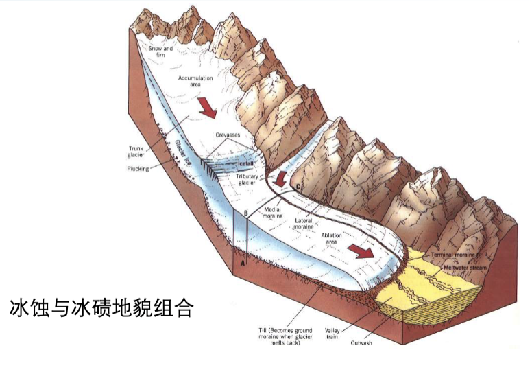
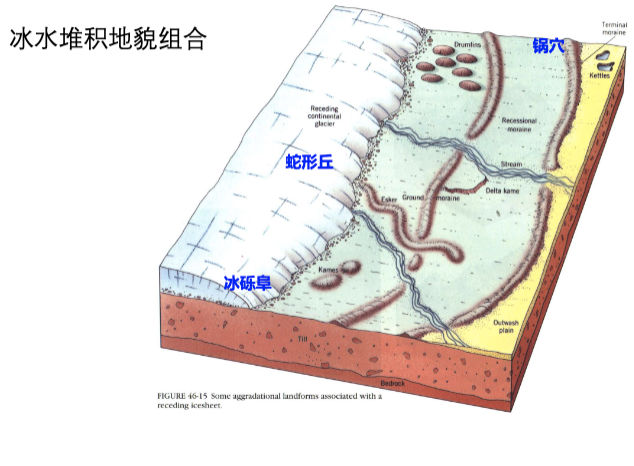
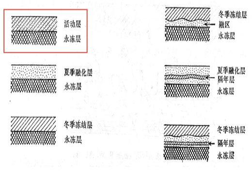
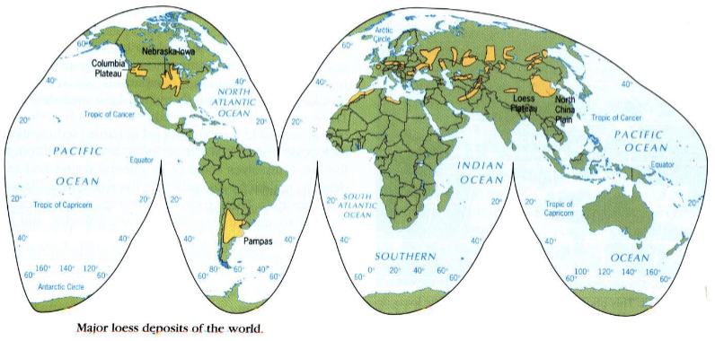
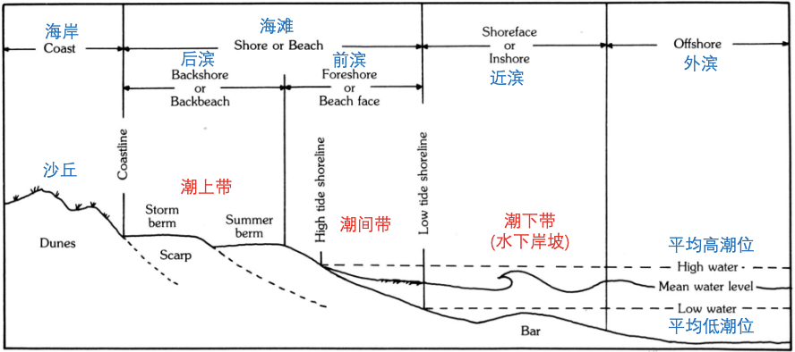
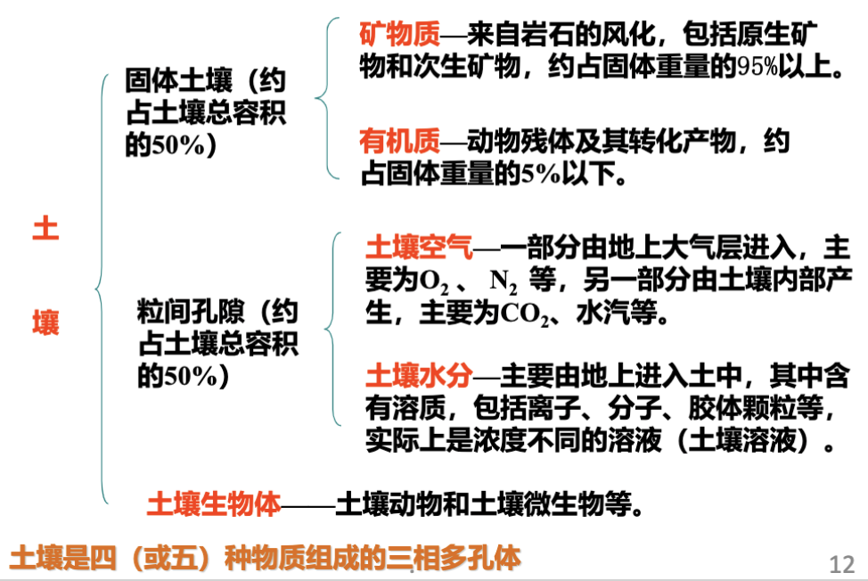
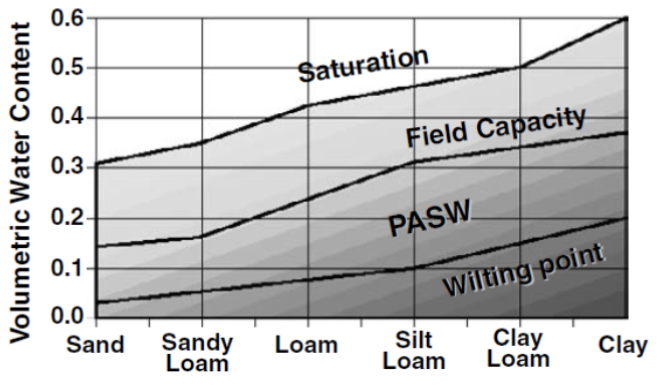
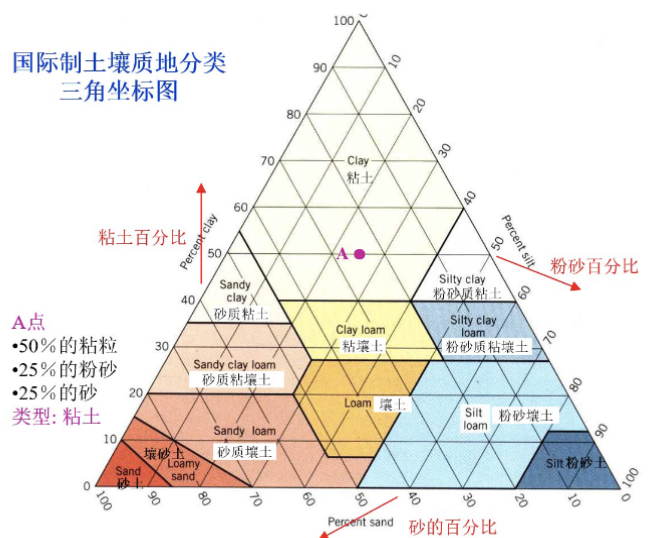
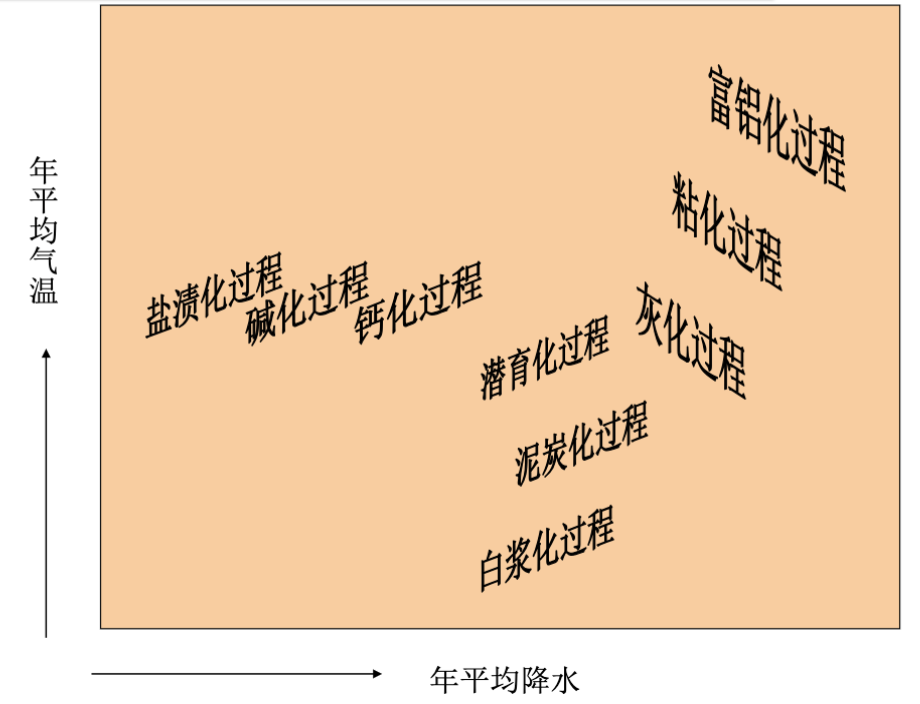
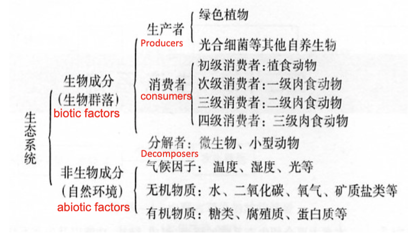

by 陈炫羽

## 名词解释

| 名词        | 解释                                                                                                  |
| --------- | --------------------------------------------------------------------------------------------------- |
| 滑坡        | 斜坡上大量==土体、岩体或其他碎屑堆积物==沿一定的==滑动面==作整体下滑的现象                                                           |
| 泥石流       | 一种饱含==大量泥沙、石块和巨砾的固、液两相流体==的==块体运动==。是一种介于==流水与滑坡之间的地质作用==                                           |
| 风化作用      | 在地表环境作用下，岩石内部结构、构造、成分发生分解，整体坚固的岩石发生破裂、变成碎屑及其他矿物质的过程                                                 |
| 河流袭夺      | 分水岭两侧的溯源侵蚀速度不同，导致相邻两条河流的分水岭迁，其中一条河流域抢夺了另一条河流的部分或全部水系的现象                                             |
| 阶地        | 河流下切侵蚀，原先的河谷底部（河漫滩或河床）超出一般洪水位以上，呈阶梯状分布在河谷两侧的地形                                                      |
| 河漫滩       | 洪水期被淹没而平水期出露水面的谷底滩地                                                                                 |
| 河曲        | 指**河流的弯曲**                                                                                          |
| 洪积扇       | ==干旱半干旱地区==的季节性或突发性洪流在河流出山口堆积形成的扇形堆积体                                                               |
| 岩溶地貌      | 地下水和地表水对可溶性岩石进行破坏和改造形成的==地貌现象==                                                                     |
| 岩溶作用      | 在可溶性岩石地区，在==地表水==和==地下水==的==化学过程==（溶解与沉淀）和==物理过程==（流水的侵蚀和沉积、重力崩塌和堆积）的共同作用下，对==可溶性岩石的破坏和改造==         |
| 冰川        | ==发生在陆地上==，由==大气固态降水==演变而成的，通常处于运动状态的天然冰体                                                           |
| 成冰作用      | 指积雪转化为粒雪，再经过变质作用形成冰川冰的过程。包括==粒雪化过程==和==成冰过程==                                                       |
| 冻土        | 凡处于==零温或负温==，并==含有冰==的各种==**土体或岩体**==                                                               |
| 多年冻土      | 连续冻结时间持续在 ==2 年==以上                                                                                 |
| 潮汐        | 由于月球和太阳引力引起的海水位周期性涨落现象                                                                              |
| 土壤肥力      | 指土壤为植物生长不断地供应和协调养分、水分、空气和热量的能力                                                                      |
| 腐殖质       | 有机质分解后再缩合或聚合而成的一系列暗色高分子有机化合物                                                                        |
| 土壤容重      | 指单位容积原状土壤（包括土粒之间的孔隙）的烘干质量（105-110ºC 下烘干重）                                                           |
| 凋萎系数      | 当植物产生==永久凋萎==时的土壤含水量                                                                                |
| 生态因子      | 指环境中对生物的生长、发育、繁殖、行为和分布有直接和间接影响的环境要素，如光照,温度,水分,土壤和其他相关生物等                                            |
| 竞争排斥原理    | 由于竟争的排斥作用，==生态位相似==的两种生物不能在同一地方永久共存                                                                 |
| 种群        | 生活在==一定空间范围内==的==同种生物==个体的集群                                                                        |
| 生物群落      | 在一定的空间范围内，各种生物种群相互联系、相互影响的有规律的一种结构单元                                                                |
| 生态系统      | 指在一定空间内生物成分（生物群落）和非生物成分（物理环境）通过物质循环和能量流动相互作用、互相依赖而形成的一个生态学功能单位                                      |
| 群落演替      | ==一定地段==上一个群落被另一群落所替代的==过程==                                                                        |
| 食物链       | 植物所固定的能量通过一系列的取⾷和被取⾷关系在生态系统中传递。生物之间存在的这种单方向营养和能量传递关系                                                |
| 生物量       | 在单位面积上净初级生产量日积月累所形成的==有机（干）物质数量==（单位 gC / m2 ）                                                      |
| 净初级生产力    | 单位时间和单位面积绿色植物通过光合作用所固定的==有机碳总量==中，扣除植物通过==呼吸作用==消耗的==有机碳==之后剩余的部分（单位 gC / m2 / a）                   |
| 净次级生产力    | 指消费者和还原者的生产，即消费者和还原者利用净初级生产量进行同化作用的过程，表现为动物和微生物的生长、繁殖和营养物质的贮存                                       |
| 生态金字塔     | 指各个营养级之间某种数量关系                                                                                      |
| 生态平衡      | 当生态系统处于相对稳定状态时，生物间和生物与环境间出现高度的相互适应与协调，种群结构与数量比例没有明显变化，能量和物质的输入与输出大致相等，结构与功能相互适应并获得最佳协调关系,这种状态就是生态平衡 |
| 水土流失      | 指在水力、重力、风力等外营力作用下，==水土资源和土地生产力==的破坏和损失，包括土地表层侵蚀和水土损失。                                               |
| 水体富营养化    | 指在人类活动的影响下，生物所需的==氮、磷等营养物质==大量进入湖泊、河湖、海湾等缓流水体，引起==藻类及其他浮游生物==迅速繁殖，==水体溶解氧量下降，水质恶化，鱼类及其他生物大量死亡==的现象  |
| 生物多样性     | 指生物圈内==生态系统组成==、==生态环境与生态功能==、==生物群落==和==生态学过程==的多样化                                                |
| 湿地        | 指天然或人工形成的永久或季节性==被浅水覆盖的区域==，包括淡水水域及河口、沿岸海洋水域                                                        |
| 碳源        | ==碳排放的源头==，是==向大气释放==C02 和 CH4 等导致温室效应的气体、含碳气溶胶或它们的前体的*任何过程、活动和机制*                                  |
| 碳汇        | ==碳的吸收与储存==，是==从大气中移走==C02 和 CH4 等导致温室效应的气体、含碳气溶胶或它们初期形式的*任何过程、活动和机制*                               |
| 自然区划      | 根据一定地域自然地理特征的相似性和差异性逐级划分或合 并自然地域单位，并按这些地域单位彼此间的从属关系，建立一定形式的==地域等级系统==                               |
| 纬度地带性     | 由于太阳辐射和热量在地表随==纬度方向==发生递变，从而导致气==候、生物等成土因素以及土壤的性质和类型==按纬度方向呈==有规律的更替==的现象                           |
| 干湿度地带性    | 由于海陆的差异以及大地构造和地形条件的影响，由于==海陆分布和大气环流等因素==的作用，从沿海到内陆降水量通常逐渐减少，使植被和土壤的性质和类型从沿海至内陆发生有规律的变化              |
| 垂直地带性     | 指随山体海拔高度的增加，温度递减，降水在最大降水高度以下向上递 增，超出该高程后减少，引起植被等成土因素以及土壤的性质发生有规 律的变化，土壤类型相应地出现垂直分带和有规律更替            |
| 可持续发展     | 以不损害后代人的生存与发展需求为前提，开发利用自然条件和自然资源， 实现当代人的社会经济发展                                                      |
| 资源环境 承载能力 | 基于特定发展阶段、经济技术水平、生产生活方式和生态保护目标， 一定地域范围内资源环境要素能够支撑==农业生产、城镇建设等人类活动==的最大合理规模                           |
| 生态系统服务    | 人类==从生态系统获得的所有惠益==                                                                                  |

## 5. 地貌

---

### 5.1. 地貌形成的影响因素

1. 构造运动与地貌发育
2. 地貌形成的气候因素
3. 岩性对地貌形成的影响

### 5.2. 滑坡形成条件与地貌特征

-   形成条件
    1. 地形条件 － 高而陡；有临空面
    2. 岩性条件 － 松散沉积物易滑；软硬夹层
    3. 构造条件 － 构造软弱面（包括顺层、不整合接触面、断层面 ）；上部透水层和下部不透水层的构造
    4. 地下水的浸泡 — 增加自重、润滑、溶解易溶物质
    5. 气候条件 － 降水
    6. 震动 － 地震、爆破
-   地貌特征
    1. 滑坡体
    2. 滑动面
    3. 滑坡后壁与滑坡台阶
    4. 滑坡舌与滑坡鼓丘
    5. 滑坡裂缝

### 5.3. 风化作用及其类型

-   类型
    1. 物理风化
    2. 化学风化
    3. 生物风化

> [!important]
>
> **物理风化作用和化学风化作用的差别**
>
> -   物理风化作用仅发生机械破碎，不发生化学变化，不生成新矿物
> -   化学风化作用不仅发生机械破碎，还要发生化学变化，甚至生成新矿物

### 5.4. 泥石流形成条件

1. 丰富的松散碎屑物质
2. 充足的水源
3. 比降较大的沟谷地形

## 6. 河流地貌

---

### 6.1. 河流作用的方式及其分别形成的主要河流地貌类型

-   河流作用的方式
    1. 侵蚀
    2. 搬运
    3. 堆积

### 6.2. 流水搬运的三种主要方式

1. 推移
2. 跃移
3. 悬移

### 6.3. 河流浅滩的成因

-   弯曲河段由于横向环流作用，凹岸侵蚀形成深槽，凸岸堆积形成浅滩
-   在相邻两个弯道，横向环流方向相反，两弯道之间的河段环流消失，泥沙堆积形成浅滩

### 6.4. 河漫滩的发育过程、结构特征

-   河漫滩的发育过程
    -   小边滩的形成：在河流旁向侵蚀作用下，凹岸侵蚀，凸岸沉积，逐渐形成小边滩
    -   大边滩(雏形河漫滩)的形成：随着边滩的加大，横向环流作用加强，凸岸的边滩宽度和高度增大，成为大边滩。
    -   大边滩演变成为河漫滩：随着河曲的发展，河床继续展宽，洪水期水流在大边滩上的流速很小，较细物质被带至其上沉积积下来，在大边滩原来的河床相较粗物质上沉积了薄层细粒河漫滩相沉积物，这时大边滩演变成为河漫滩。
-   河漫滩的结构特征
    二元结构，下部为粗粒推移质组成的河床相冲积物，上部为细粒悬移质组成的河漫滩相冲积物

### 6.5. 阶地的类型、成因

-   **阶地的类型**
    1. 侵蚀阶地
        - 由基岩组成，在阶地面上没有或只有零散冲积物
        - 发育在构造抬升的山区河谷中
    2. 堆积阶地
        - 全部由冲积物组成，在河流下游最常见
    3. 基座阶地
        - 由两层不同物质组成，上层为河流冲积物，下层为基岩或其他成因类型的沉积物。
        - 后期侵蚀切割的深度超过冲积物的厚度
-   **阶地的成因**
    -   构造运动 Tectonic activities
        当地壳相对稳定或下降时，河流以侧向侵蚀作用为主，此时塑造出河漫滩；然后地壳上升，河床纵比降增加，水流转而下切，于是原来的河漫滩成了河谷两侧阶地。如果地壳多次间歇性上升，则可形成几级阶地。
    -   气候变迁 Climate changes
        气候变化影响到河流水量和含沙量。气候变干时，河水量减少，而地面植被稀疏，坡面侵蚀加剧，形成阶地；气候变湿时，河水量增多，植被强，河水含沙量相对增多，此时河床堆积作用较强；而气候湿润期，河水量增多，植被茂盛，河水含沙量相对变少，导致河流下蚀，形成了阶地。

### 6.6. 三角洲的发育过程

-   **浅滩与拦门沙发育阶段**
    河流出口门之后水流分散，泥沙堆积形成水下浅滩、河口沙坝
-   **河流分汊与河口沙岛形成阶段**
    河口沙坝和边滩不断增高，逐渐露出水面变成沙岛。水面也被分割成几股汊道，并形小海湾、泻湖或沼泽洼地。
-   **沙岛合并阶段**
    汊道的沉积与堆积过程不均匀发育，某些汊道淤塞，导致沙岛的联合或并岸。这种过程持续进行，最后成为三角洲平原。

### 6.7. 三角洲的分类及各类型的形态特征

-   三角洲的分类（按三角洲形成的主要营力分）
    1. **径流型**
       河流作用力较强，泥沙来源丰富，波浪、潮汐作用较弱，形成鸟爪形、舌形等形态的三角洲，如密西西比河、伏尔加河、黄河、多瑙河等三角洲。
    2. **波浪型**
       波浪作用较强烈，三角洲沉积物经波浪的再次侵蚀、搬运和堆积，形成平行海岸的沙坝、沙滩，三角洲呈向海突出的尖头形、扇形、弓形，如尼罗河三角洲。
    3. **潮汐型**
       潮汐作用较强烈，形成一系列由粉砂和淤泥构成的、平行潮流的长条状沙脊（水下）、沙岛（水上）等堆积形态，沙脊或沙岛之间被潮汐通道分隔，呈多岛形，如湄公河、恒河、长江等三角洲。

## 7. 岩溶地貌

---

### 7.1. 岩溶发育的基本条件

1. 岩性与构造条件
    1. 岩石的可溶性
        1. 岩石的化学成分
            - 卤化盐类岩石: 如钾盐、石盐
            - 硫酸盐类岩石: 如硬石膏、石膏、芒硝等；
            - 碳酸盐类岩石 Carbonate rock: 如石灰岩 limestone、白云岩 dolomite 等。
            - 溶解度：
                - 卤盐＞硫酸盐＞碳酸盐
                - 在碳酸盐岩类中，CaCO3 的含量越高，其他杂质含量越低，其溶解度就越大
                - 石灰岩＞白云岩＞硅质灰岩＞泥灰岩
        2. 岩石的结构
            1. 岩石的结构与溶解度有密切关系。对于结晶的岩石，晶粒越小，溶解度也越大。
    2. 岩石的透水性
        1. 透水性指岩石能被水透过的性能，影响岩石的溶蚀速度
            1. 透水性不良的岩石，溶蚀作用只限于岩石表面，很难深入岩石内部
            2. 透水性好的岩石，地表和地下溶蚀都很强，地貌发育也好。
        2. 透水性主要取决于裂隙发育程度
            1. 一般石灰岩的原生孔隙度 Porosity 都很小, ＜ 3％，透水性较弱
            2. 透水性主要取决于裂隙发育程度，而裂隙发育程度主要受断裂构造(各种断层、裂隙) 控制。节理、断层不仅提供了水进入岩体内部的通道，而且增加了水与岩石作用的面积
2. 水动力条件
    1. 水的溶蚀性
        - 溶解于水中的 CO2 越多，水的溶蚀力就越强；水中的 Ca+2 的含量越高，水的溶蚀力就越弱。
            - 水中的 CO2 主要来自土壤，土壤 CO2 浓度比大气高 1 ～ 2 个数量级
            - 水中含不同游离 CO2 时的碳酸盐类岩石溶解度
            - 纯水的溶解度 11.5 mg/L
            - 含 1 mg/L CO2 水的溶解度  60~50 mg/L
        - 温度越高，水的化学反应速度越快，溶蚀力越强
        - 气压越大，溶蚀力越强（水中 CO2 的含量与气压成正比）
    2. 水的流动性
        - 流水经常与空气保持接触，能不断地补充因溶蚀岩石所消耗的 CO2，使水体不易达到饱和。因此，水体经常流动，能大大提高水的溶蚀力。
        - 热带地区高温多雨，水流量大、水循环快，加上气温高及生物作用强，岩溶发育最快。
            - 如亚热带广西碳酸盐岩溶蚀量为 0.12 ～ 0.3mm/a，是暖温带的河北（溶蚀量为 0.02 ～ 0.03mm/a）的 5 ～ 9 倍。

### 7.2. 地表、地下岩溶地貌类型

-   地表岩溶地貌
    1. 石芽与溶沟
        - 地表水沿岩石裂隙溶蚀、侵蚀而成的沟槽形态，称为**溶沟**
        - **石芽**为溶沟之间突起的石脊
    2. 岩溶漏斗
        - 直径数十米，深数米至十几米，呈碟形或倒锥形洼地
    3. **落水洞**：直径一般数米~数十米，深数十米至数百米，多分布于较陡的坡地两侧和盆地、洼地底部，也是流水沿裂隙侵蚀的产物。
    4. **溶蚀洼地**：直径超过 100 米，最大可达 1-2 公里，面积小于 10km2
    5. **岩溶盆地与岩溶平原**: 面积 10~100 km2 以上
    6. **峰丛、峰林与孤峰**
-   地下岩溶地貌
    1. 溶洞
    2. 盲谷与干谷
        - 盲谷（断尾河）：指地表河流流至石灰岩地区水流流进落水洞而形成的没有谷口的死胡同或河谷
        - 干谷：地表水通过落水洞转入地下，使地表原来的河谷变成干涸的河道
        - 断头河：由喀斯特陡壁下流出的喀斯特泉或地下河，在地表出露形成的河流
    3. 洞穴堆积物
        1. 化学堆积物
           石钟乳 stalactite、石笋 stalagmite 、石柱 column、石幕和泉华等
        2. 机械堆积物
           河流沉积，湖泊沉积，崩塌沉积
        3. 生物堆积物

### 7.3. 岩溶水的垂直分带及各带的岩溶发育特点

-   垂直渗流带
    -   位于地表以下至地下水的高水位之间（包气带）
    -   垂直入渗带的岩溶地貌发育规模小，且以垂直形态为主
-   季节变动带
    -   地下水面随季节变化而升降, 地下岩溶水的流动方向随季节变化而具有周期性变化
    -   岩溶作用很活跃，岩溶地貌的垂直形态和水平形态均很发育，如溶洞与暗河系统等
-   水平流动带
    -   位于枯水期地下水面以下，处于常年有水的饱和状态
    -   岩溶地下水流动交换快，水流溶蚀力强、岩溶作用剧烈，常形成规模很大的水平溶洞或暗河
-   深部循环带
    -   位于水平流动带之下，其下限很深。岩溶地下水的运动已不受当地水文网的影响，主要受地质构造控制，具有承压性
    -   岩溶作用非常微小

### 7.4. 岩溶地区水文特征

1. 地表水大部或几乎全部流入岩溶岩层以补给地下水，地表河网密度较小
2. 地下径流往往大于地表径流
3. 地表分水岭与地下分水岭常不一致，导致流域常具有非闭合现象
4. 由于可溶性岩石的节理裂隙分布复杂，地下径流具有高度复杂性与不均匀性

## 8. 冰川与冻土地貌

---

### 8.1. 冰川类型与分布

-   冰川类型
    1. 大陆冰川：面积大于 5×104 km2，冰体呈盾形，几乎不受下伏地形影响，自中心向四周外流
    2. 冰帽：面积小于 50,000 km2。冰面整体呈穹隆状，基本覆盖下伏地形，呈放射状向四周流动
    3. 山地冰川：从围椅状洼地延伸到谷坡，通常沿山谷分布，有狭窄而长冰舌
-   冰川的分布
    -   目前全球冰川与大陆冰盖总面积约 16 x 106 km2, 约占全球陆地面积的 10% ，冰川与冰盖储存的淡水资源占全球的 75%
    -   冰川分布与雪线高度密切相关
        -   雪线：多年积雪区与季节积雪区间的界线
        -   冰川发育在雪线以上的高寒地区 ，但冰川的分布下限低于雪线。
    -   影响雪线高度的三个因素

### 8.2. 影响雪线分布高度的因素

1. 气温：自两极向赤道升高
2. 降水量：一般固态降水越多，雪线越低；固态降水越少，雪线越高
3. 地形
    - 坡度、坡形
    - 坡向
        - 阳坡与阴坡
        - 迎风坡与背风坡

### 8.3. 冰川作用的方式

1. 侵蚀作用
    - 磨蚀
    - 刨蚀
    - 拔蚀
2. 搬运作用
3. 堆积作用

### 8.4. 冰川侵蚀作用形成的地貌类型（冰碛地貌）

-   冰斗：三面环以陡峭岩壁、呈半圆形剧场形状或圈椅状的洼地；
-   刃脊
-   角峰
-   U 形谷
-   悬谷
-   羊背石

### 8.5. 冰川堆积作用形成的地貌类型

-   冰碛丘陵
-   侧碛堤
-   终碛堤
-   鼓丘

### 8.6. 冰水堆积地貌类型

-   冰水扇
-   冰水冲积平原
-   冰水湖与季候泥
-   冰砾阜与冰砾阜阶地
-   锅穴
-   蛇形丘

### 8.7. 山地冰川地貌、大陆冰川地貌的组合特征

-   山地冰川——垂直带
    -   雪线以上是以冰斗、刃脊和角峰为主的冰蚀地貌带；
    -   雪线以下，终碛堤以上是以冰槽谷，侧碛堤和冰碛丘陵为主的冰蚀——冰碛地貌带；
    -   冰川末端是以终碛堤为代表的冰碛地貌带；
    -   终碛堤外缘，表现为冰水扇和冰水扇平原的冰水堆积地貌带
-   大陆冰川——水平带
    -   终碛堤堤内以冰碛地貌为主，尤以冰碛丘陵为代表；
    -   终碛堤外以冰水地貌为主，尤以冰水冲积扇平原为代表

### 8.8. 冻土的结构

### 8.9. 多年冻土的分布特点

-   受气候因素的主导作用，具有明显的纬度地带性和垂直地带性
    -   从高纬向低纬方向，厚度变薄，而且由连续的冻土带过渡到不连续冻土带；
    -   海拔越高，冻土层越厚，多年冻结层的顶面埋藏深度减小。
-   还与其它自然条件有关
    -   海陆分布
    -   岩性
    -   坡向和坡度
    -   植被与雪盖

### 8.10. 主要冻土地貌类型

1. 石海、石河
2. **多边形构造土**:因土层冻裂，并被冰楔或沙楔充填而成的多边形网格式地面
3. **石环**:因冻土活动层中大小混杂的松散砂砾，经冻融分选而形成的中心为细粒物质，周围为较大砾石的环状地面形态称石环
4. 冰核丘（冻胀丘）
5. 热融地貌

## 9. 风沙黄土地貌

---

### 9.1. 风力搬运的三种方式

-   悬移 - 颗粒小于 0.2mm 的沙泣，在风速 5 米/秒时，呈悬浮状态移动
-   跃移 - 飞跃的颗粒降落时碰撞地面，产生回弹跳跃
-   蠕移 - 跃移的沙粒在降落时对地面产生冲击，使地表的较大沙粒缓缓向前移动

> [!important] > **以跃移方式为主(约占 70％～ 8O％)，蠕移次之(约占 20％)，悬移最少(一般不超过 10％)**

### 9.2. 风积物的特征

-   从风源地开始，沿风的前进方向，风积物的粒径由粗逐渐变细，依次为细砾带、粗沙带、中沙带、细沙带、粉土带。
-   地面较细小的砂、砾被风刮走后，形成地势起伏平缓、地面覆盖大片砾石的荒漠，被称为戈壁

### 9.3. 风蚀地貌与风积地貌主要类型

-   石窝: 直径 20 cm 至 l ~2 m, 深 10 - 15 cm 上下至 l m 的圆形或椭圆形小块石头，洞或凹坑，通常出现于迎风崖壁上，密集时犹如蜂窝，
-   风蚀柱与风蚀磨菇:
-   风蚀洼地
    -   松散物质组成的地面，经风吹蚀以后，形成宽广而轮廓不太明显的风蚀洼地。
    -   多呈椭圆形，成行分布，并沿主风向伸展。
    -   单纯由风蚀形成的洼地，规模较小，一般直径只有几十米，深度仅 1 米左右。一些大型风蚀洼地，是在流水侵蚀基础上再经风蚀改造而成，深度可达 10 米左右。
-   风蚀谷与风蚀残丘
    -   荒漠区有时一次暴雨能把地面侵蚀成很多沟谷，风就沿着沟谷吹蚀，沟谷进一步扩大，成为风蚀谷。
    -   风蚀谷无一定形状和走向，宽窄不均，蜿蜒曲折，有时为狭长的沟壕，有时又为宽广的谷地
-   雅丹地貌
-   垂直于风向的横向沙丘
    -   新月形沙丘
    -   新月形沙丘链
    -   抛物线形沙丘
    -   横向沙垄
    -   纵向沙垄
-   多风向形成的沙丘
    -   星形沙丘
    -   蜂窝状沙丘

### 9.4. 全球荒漠地貌的分布

全世界陆地面积为 1.49 亿 km2，其中约 1/3（4800 万 km2）是干旱、半干旱荒漠

-   陆地表面荒漠分布集中在以下三类地区
    -   副热带高压带区
    -   中纬度大陆内部地区
    -   寒流经过的沿海地区

### 9.5. 黄土的分布与主要特征

-   分布
    
-   主要特征
    -   颜色：灰黄、棕黄或棕红色；
    -   粒度成分：以粉砂为主，粘粒、细砂较少；
    -   矿物成分：包括碎屑矿物（主要是石英、长石和云母）、粘土矿物和碳酸盐类矿物（主要是方解石）；
    -   物理性质：土质疏松，多孔隙，垂直节理发育，抗蚀力弱，具有湿陷性

### 9.6. 黄土沟谷地貌、沟间地貌主要类型

-   黄土沟谷地貌
    -   细沟：宽不超过 0.5 米，深约 0.1-0.4 米，长数米至数十米
    -   切沟：宽、深可达 1-2 米，长数米至数十米，剖面尖 V 形
    -   冲沟：深可达数十至百米，长可达数公里至数十公里，V 形
    -   河沟：沟床纵剖面的坡度较缓，沟谷停止下切，剖面呈 U 形，沟底平坦且有冲积物
-   沟间地貌
    -   塬:由黄土覆盖的一种范围较广、被沟谷环绕的平坦高地
    -   墚:长条形的黄土高地，长几百米至数十公里，但宽度仅几十米到数百米。
    -   峁:孤立的黄土丘，外形呈圆穹状，峁坡均成凸形斜坡

## 10. 海岸地貌

---

### 10.1. 海岸带的组成

### 10.2. 塑造海岸地貌的主要动力作用类型

1. 波浪（塑造海岸地貌的最重要动力）
2. 潮汐（塑造海岸地貌的最重要动力）
3. 沿岸海流
4. 径流

### 10.3. 海岸带波浪的变形

-   波浪的传播
    -   **深水区**，水深 H>1/2 波长波浪进行完整的圆形轨迹运动
    -   **浅水区**，H<1/2 波长，波浪开始变形，水质点运动轨迹为椭圆形。浅水波与深水波比较，波速减小，波长变短，波高增加
    -   **破浪带**，当 H =2× 波高，波浪发生局部破碎，形成破浪
    -   **拍岸浪带**，H≤ 波高，海底摩擦作用使波顶运动速度大于波底，最后波峰越过波谷而发生破碎，称为激浪
-   波浪的折射
    -   由于波浪受海底摩擦阻力影响大小不一，使波向发生转折，最终波峰线基本与海岸线平行
-   波浪的绕射
    -   当波浪传入近岸时，如果受到沙嘴、岬角等的阻挡时，波浪将从其旁边绕过、进入波影区，波峰线变形，波高递减，波浪能量大为减小，故波影区一般为比较平静的水域。

### 10.4. 潮汐的成因

-   天体引潮力 Tidal force: 月球、太阳和其他天体对地球表面上单位质量物体的引力和地球绕地月(或地日)公共质心旋转而产生的惯性离心力的合力。
    -   月球引潮力是太阳的 2.17 倍。
-   引潮力在地球朝向月球与太阳的一面以及背向月球与太阳的一面同时发生

### 10.5. 海蚀地貌类型

1. 海蚀穴与海蚀崖
2. 海蚀平台与海蚀阶地
3. 海蚀拱桥与海蚀柱

### 10.6. 泥沙横向运动过程及其形成的海积地貌

> 泥沙横向运动：当外海波浪以与岸线成正交的方向传来时，海岸的泥沙在波浪底流作用下，垂直海岸线运动，这称为泥沙的横向运动。

1. 海滩
    - 指沿海岸分布，由松散泥沙或砾石堆积而成的平缓地面
    - 由滩肩、滩脊、滩槽等构成
    - 一般分布在平均低潮线以上，范围从波浪破碎处开始，向上延伸到组成物质或地形有显著变化的滨海陆地。
    - 海滩物质一般上部较粗，滩坡坡度较大；下部物质较细，滩坡平缓。
    - 按组成物质颗粒的大小，海滩可分为砾石滩（卵石滩）、粗砂滩和细砂滩
    - 滩肩:海滩上“后滨”前缘的台坎状小地貌，由风暴浪堆积的物质被冲刷而成
    - 滩脊也称沿岸堤:由波浪作用形成的海滩上与岸线平行的垄岗状砂砾质堆积体，是海滩(beach)上的最基本的地貌形态,相邻滩脊间的凹槽称为滩槽
2. 水下沙坝
    - 指在破浪带内，未出露海面的与海岸大致平行的狭长堆积体:由破浪作用形成
    - 当泥沙的横向运动形成的水下沙坝不断加积或海平面下降，露出水面后就成为海岸沙坝，如果其与海岸不相连则称为离岸堤
    - 水下沙坝向岸一侧相对低洼的水槽称为沿岸槽
3. 海岸沙丘
    - 成因有三种：风暴潮堆积；古海滩沙脊；风成

### 10.7. 泥沙纵向运动过程及其形成的海积地貌

> 泥沙纵向运动：外来波浪与海岸斜交，海岸带泥沙所受的波浪作用力与重力沿坡切向力的合力不在一条直线上，泥沙沿两者的合力方向运动，在横向运动的同时，发生沿岸的纵向移动

1. 凹岸海滩:凹岸是前段海岸向海转折，导致波射线与海岸的交角增大，因而泥沙的纵向迁移受阻，泥沙搬运能力降低，在凹岸范围内发生堆积形成凹岸海滩
2. 凸岸沙嘴:由于岸线走向变化使波浪作用强度减弱，沿岸流流速减缓，挟沙能力降低，而发生堆积，形成一端与陆地相连，另一端向海伸出的泥沙堆积体
3. 波影区连岛沙坝:连接陆地与岛屿的沙坝,外海波浪遇到岛屿时，波浪折射，能量减弱，形成波影区，发生堆积，形成向海突出的三角形沙嘴，如果泥沙来源充足，则不断发育，形成连岛沙坝

### 10.8. 主要潮成地貌类型

1. 潮滩
    - 潮滩物质来源有四类：1 来自海洋；2 来自邻近河流；3 来自海岸侵蚀物；4 潮滩所在海岸自身，受再搬运进入潮滩。
    - 以潮流搬运为主
    - 潮滩可以分为潮上带、潮间带、潮下带
2. 潮沟
    - 指潮滩上发育的沟谷系统，其平面形状有平直的及树枝状的两类。前者是由岸向海的平行沟槽。
    - 潮沟一般发育在淤积型和稳定型粉砂淤泥质海岸；
    - 大多数潮沟具有树枝状形态。
3. 潮流沙脊
    - 沿岸浅滩上潮流作用形成的一系列长条形沙体
    - 延伸方向与潮流方向一致，常呈沟脊相间排列

### 10.9. 潮滩与海滩的区别

-   海滩是砂砾质，由波浪（激浪流）作用而成，属高能环境的堆积体
-   潮滩是细颗粒的粉砂淤泥，主要受潮汐作用，是低能环境下形成的

### 10.10. 海岸地貌组合结构

1. 沙坝—泻湖体系
    - 由沙坝(离岸堤或沙嘴)、泻湖、潮汐通道 和潮成三角洲
    - 泻湖指由离岸堤或沙嘴将滨海海湾与外海隔离的水域
    - 离岸堤形成后，被潮水冲刷，形成潮汐通道
    - 潮汐通道内外侧分别形成涨潮流三角洲及落潮流三角洲
2. 基岩海岸的海积地貌结合

### 10.11. 海岸类型

1. 岬湾海岸(基岩海岸（山地海岸）)：岬角海湾相间分布，岸线曲折，岬角发育海蚀地貌，海湾内以堆积为主
2. 峡湾海岸(基岩海岸（山地海岸）)：海水淹没山地古冰川 U 形谷
3. 断层海岸(基岩海岸（山地海岸）)：岸线与断层走向大致平行
4. 珊瑚礁海岸(生物海岸):
5. 红树林海岸
    - 红树林
        - 耐盐、喜盐性植物群落
        - 发育在热带、亚热带潮坪上，涨潮时树冠漂荡于海面
    - 红树林海岸在淤泥质海岸发育最好

## 11. 土壤

---

### 11.1. 土壤的基本属性

具有肥力

-   土壤学中把水、肥、气、热——称为四大肥力因素。
-   水、肥、气是**物质基础**,热是**能量条件**。
-   任何一个土壤的肥力特征都是水,肥,气,热各肥力因素的综合反映.困难之处在于如何把它们量度和表达出来,这也是土壤学在现代化过程中需要努力的重要方向之一。

### 11.2. 四大肥力因素

土壤学中把水、肥、气、热——称为四大肥力因素。

### 11.3. 土壤圈的纽带作用

通常把地球表层系统中的**大气圈、生物圈、岩石圈、水圈和土壤圈**作为构成自然地理环境的五大要素
土壤圈覆盖于地球陆地表面，处于其他层的交接面上，成为它们连接的纽带

### 11.4. 土壤的基本物质组成

### 11.5. 土壤有机质转化的两个过程

**腐殖质化过程 (Humification)：**

指进入土壤中的动植物残体，在土壤微生物的作用下，分解后再缩合和聚合成一系列暗黑色高分子有机化合物的过程。

**矿质化过程 (Mineralization)：**

指进入土壤中的动植物残体，在土壤微生物的参与下，将复杂的有机物质分解为简单化合物的过程。

> 土壤微生物 (microorganisms)是土壤有机质转化的主要动力

### 11.6. 土壤水类型及土壤含水量的常用表示方法及互相转化关系

-   土壤水类型
    -   束缚水
        -   吸湿水
        -   膜状水
    -   自由水
        -   毛管水
        -   重力水
-   **土壤含水量（湿度）的常用表示方法**
    -   土壤质量含水量$\theta=[(m_湿-m_干)/m_干]\times 100%$
    -   土壤容积含水量$\theta=v_水/v_土\times 100\%$
    -   土壤相对含水量$\theta = 含水量/土壤田间持水量\times 100\%$

### 11.7. 凋萎系数、田间持水量、饱和含水量与土壤粒径的关系

-   凋萎系数：当植物产生永久凋萎时的土壤含水量。此时土壤水包括全部的吸湿水和部分膜状水,凋萎系数与土壤质地、有机质含量等因素有关。粘粒含量越多、有机质含量越高，凋萎系数越大
-   田间持水量 ：毛管悬着水达到最大时的土壤含水量,与土壤质地、有机质含量等因素有关
-   土壤饱和含水量 : 土壤所有孔隙都充满水时的含水量，也称为土壤全持水量,饱和含水量如按容积%计，则相当于土壤有效孔隙度

### 11.8. 有效水分的计算

> 土壤水分的有效性指土壤水分能够被植物吸收利用的难易程度，不能被植物吸收利用的称无效水，能被植物吸收利用的称为有效水（plant-available soil water content ，PASW ）

-   土壤有效水分的下限为凋萎系数（萎蔫系数）
-   旱地土壤有效水分的上限为田间持水量
-   旱地土壤最大有效水分量 = **田间持水量 - 萎蔫系数**

### 11.9. 常用的土壤水分测定方法

-   烘干法
-   中子土壤水分仪
-   张力计式土壤水分传感器
-   频域反射仪（FDR）
-   时域反射仪（TDR）
-   卫星遥感
-   探地雷达

### 11.10. 国际制土壤质地分类三角坐标图的使用

### 11.11. 土壤容重、密度及孔隙度

-   土壤容重:指单位容积原状土壤（包括土粒之间的孔隙）的烘干质量（105-110ºC 下烘干重）
    -   反映土壤松紧程度
-   土壤密度:单位体积(不包括孔隙)的烘干土壤固体物质重量），单位以 g/cm 3 或 t/m3 表示
    -   2.6 ~ 2.7 g/cm3
-   土壤孔隙度:指土壤孔隙占土壤总体积的百分比
    -   土壤质地决定了土壤中的小孔隙的数量，土壤结构影响到大孔隙的数量
    -   孔隙度大小：砂土 < 壤土 < 粘土 < 泥炭土
    -   理想的土壤：约 45％矿物质、5％有机质和 50％孔隙

### 11.12. 土壤胶体的性质

-   巨大的**比表面和表面能**
    -   单位质量或体积物体的总表面积称为比表面积
-   带电性
    -   大部分土壤胶体带负电荷
-   分散和凝聚性
    -   土壤胶体呈溶胶和凝胶二种状态存在，可以相互转化
    -   由溶胶转为凝胶称凝聚作用。
    -   由凝胶转为溶胶称消散作用。

### 11.13. 土壤酸碱性与缓冲性的来源

-   土壤酸碱性
    -   酸性
        -   活性酸度 active acidity：存在于土壤溶液中游离的氢离子引起的酸度
        -   潜性酸度 potential acidity ：土壤胶体所吸附的 H+和 Al3 ＋被交换出来进入土壤溶液中所显示的酸度
        -   潜性酸度大于活性酸度，二者的总和，称为土壤总酸度
    -   盐基饱和的土壤具有中性或碱性反应；而盐基不饱和的土壤则具有酸性反应，为酸性土壤
        -   **气候湿润多雨地区**淋溶强度大，盐基离子易流失，呈**酸性**；
        -   **干旱和少雨地区**淋溶弱，盐基离子富集于土壤中，大多**呈中性或碱性**；
-   土壤缓冲性的来源：主要来自土壤胶体及其吸附的阳离子；其次来自土壤所含的弱酸及其盐类
    -   土壤阳离子交换量愈大，缓冲能力愈大。
    -   土壤胶体上吸收的盐基离子多，则土壤对酸的缓冲能力强；当吸附的阳离子主要为氢离子时，对碱的缓冲能力强。

### 11.14. 自然土壤剖面的基本层次（主要发生层）

-   有机层（O）-> 以分解的或未分解的有机质为主的土层
-   腐殖质层（A）-> 成于表层或位于 O 层之下，土层中混有有机物质，或具有因耕作、放牧或类似的而形成的土壤性质
-   淋溶层（E）-> 硅酸盐粘粒、铁、铝等单独或一起淋失，石英或其他抗风化矿物的砂粒或粉粒相对富集；
-   淀积层（B）-> 在上述各层之下，且具有下列性质：
    -   硅酸盐粘粒、铁、铝、腐殖质淀积；
    -   残余二、三氧化物相对富集；
    -   土体色调一般发红或棕；
    -   土体较紧实
-   母质层（C）-> 多数是矿质土层，但有机的湖积层也属于 C 层；
-   母岩层（R）-> 基岩

### 11.15. 主要成土因素

> 成土因素说的创始人——道库恰耶夫 ( Vasili Vasilievich Dokuchaev)

$$\Pi =  f(K,O,\Gamma,P)T$$

1. 母质 2. 气候 3. 生物 4. 地形 5. 时间

### 11.16. 不同成图因素对土壤形成的作用

#### 母质

-   母质类型按成因可分为残积母质和运积母质两大类
    -   残积母质：指岩石风化后，基本上未经动力搬运而残留在原地的风化物
    -   运积母质：指经搬运而迁移堆积的物质
-   **母质对成土过程的影响**
    -   母质是土壤形成的物质基础
    -   许多土壤的属性继承了母质的性质；
    -   不同母质对土壤次生矿物也有影响；
    -   不同母质所形成的土壤养分状况不同；
    -   成土母质影响土壤的质地

#### 气候

-   气候因素影响土壤水热状况，是影响土壤地理分布的基本因素；
-   气候影响次生粘土矿物的形成；
-   气候影响岩石矿物风化强度；
-   气候对土壤有机质的积累和分解起重要作用；
-   气候影响土壤微生物的数量和种类

#### 生物

-   生物是土壤有机质的制造者和分解者，是土壤发生发展过程中最活跃的因素;
-   绿色植物：利用太阳能进行光合作用制造活体有机质，在以有机生物残体形式聚集于母质表层，推动土壤的形成和演化
-   土壤微生物(microbes)：分解动植物有机残体，释放潜藏的能量和养分供生物再吸收利用，促进土壤费力不断发展，并参与土壤腐殖质的形成
-   土壤中的原生动物：参与土壤有机质的分解、破碎、翻动、搬运，其残体也是土壤有机质的来源之一

#### 地形

-   地形引起地表物质与能量的再分配，间接影响土壤与环境间的物质与能量交换
-   不同地形影响地表水热条件的重新分配；
-   不同地形的地表径流差异、土壤水分储存条件的差异，使不同地形部位的土壤 成土过程不同；
-   地形影响母质的分配，相应产生的土壤的物质组成不同；
-   地形的变化会相应引起土壤发育过程的变化。

#### 时间

-   土壤的发生、发展与演变具有时间上动态性；
-   土壤的发育程度随时间的增长而加强，母质、气候、生物、地形等因素在土壤形成过程中的作用强度均随土壤年龄的增长而加深

#### 人类活动

-   人类能对土壤进行利用、改造、定向培肥，创造不同熟化程度的耕作土壤，其影响可以较快发生
-   人类活动的影响通过改变各自然因素而起作用，并可分为有利和有害两个方面

### 11.17. 土壤形成中的物质循环

**地质大循环**

-   指原有岩石出露地表，通过风化作用变成细碎或可溶的物质，被流水搬运到海洋，经过漫长的地质年代变成沉积岩；当地壳上升，沉积岩又出露地表，再次受到风化。
    -   一方面释放出可溶性物质——植物吸收的矿物养分；
    -   另一方面产生碎屑物质——土壤母质。母质源源不断地提供可溶性矿物质。
    -   地质淋溶不能提供植物生长的全部养分，如氮等

**生物小循环**

-   指植物吸收利用大循环释放出来的可溶性养分，通过生理活动转变为植物的有机体，当植物有机体死亡后，由微生物将其分解进入土壤

### 11.18. 主要成土过程

1. **原始成土过程**
    - 从裸露岩石表面及其风化物上低等植物着生到高等植物定居之前,在低等植物和微生物参与下形成土壤的过程。
    - 包括着生蓝藻、绿藻、甲藻、硅藻等岩生微生物的“岩漆”阶段，地衣阶段和苔藓阶段。
2. **灰化过程**
    - 指土体亚表层 SiO2 残留，而三氧化物及腐殖质淋溶、淀积的过程
    - 主要特征：有一个灰白色的淋溶层 - 灰化层
    - 典型土类：灰化土
3. 粘化过程
4. 富铝化过程
5. 钙化过程
6. 盐渍化过程
7. 碱化过程
8. 潜育化过程
9. 潴育化过程 （假潜育化）
10. 白浆化过程
11. 腐殖质化过程
12. 泥炭化过程
13. 土壤的人为熟化过程

### 11.19. 成土过程和气候的关系

## 12. 生物圈

---

### 12.1. 不同生态因子对生物的作用

**光与生物**

-   光的性质（波长）
    -   植物光合作用利用的太阳辐射集中在波长 400 ~ 700 nm，这一波段的辐射称为==光合有效辐射==
    -   红光和蓝光被绿色植物吸收得最多，是光合作用 中最有效的生理辐射光。
-   光强影响植物光合作用效率
    -   光照强度依纬度、地形、季节以及云量等的不同 而变化。
    -   不同植物对光照强度要求不同:喜阳植物,喜阴植物,耐阴植物
    -   根据对光照时数要求不同，植物划分为长日照植 物、短 H 照植物和中间性植物等类型
-   不同动物对光强反应也不一样，光照强度的昼夜变化与季节变化影响了动物行为
    **温度与生物**
-   温度对动植物生长发育的影响
    -   动、植物生长发育的温度范围
    -   极端温度使植物产生一系列的适应特征
    -   温度影响动物的形态
        -   贝格曼定律
        -   阿伦定律
-   温度影响动植物的物候
-   温度影响动物的行为
-   温度影响动植物的地理分布
    **水与生物**
-   水是生物有机体重要组成成分，并参与生物的各种生理过程
-   不同水分状况影响动植物的数量和分布
-   不同水分状况影响动植物的生长发育及形态
    **空气与生物**
-   空气化学成分对生物的影响
-   空气运动对生物的影响
    **土壤与生物**
-   土壤是陆生植物生长发育的基地和营养库
-   土壤为动物提供了一个较稳定的生活环境
-   土壤污染不仅影响作物生长发育，造成减产和品质降低，并通过水体、大气、⾷物链对人类和其他动物产生危害

### 12.2. 种间关系类型

-   **竞争**:指两种生物共居一起，相互争夺有限的营养、 空间
    -   种间竞争的方式
    -   种间竞争的结果
-   **捕⾷**:指一种生物以另一种生物为⾷
    -   草⾷是一种广义的捕⾷
-   **寄生作用**:指一种生物生活在另一种生物的体内或体表，并从后者摄取营养以维持生活的种间关系
-   **偏害作用**:一个物种的存在可以对另一物种起抑制作用
-   **原始合作**:两种生物同处，互不侵犯，和平共处，但双方离开后，都能各自生存
-   **偏利共生**:两种共处，一方受益，对另一方也无害
-   **互利共生**:两种生物共居在一起，互相依赖，相互依存，一旦分离，双方都不能正常地生活

### 12.3. 生物适应环境的策略与方式

### 12.4. 生物群落有哪些结构特征

1. 具有一定的种类组成
    - 环境条件愈优越、群落发育时间愈长和群落内部物理环境愈复杂，即==空间异质性程度愈高==，==生物种的数目愈多==
    - 群落成员型分类
        - 优势种:个体数量多、生物量大、地面覆盖度大
        - ==建群种:优势种中的最优势者==
        - 附属（伴生）种:次要的种类
        - _优势种侧重于描述物种在群落内的相对重要性，强调的是种群数量、分布范围以及对生态系统影响的强度；而建群种则更看重物种在构建群落结构、形成群落特色方面的核心作用。_
2. 具有一定的群落外貌
    - 群落的外貌主要取决于群落优势种的**生活型**
    - ==生活型：植物长期受一定的环境综合影响所表现出的生长形态==
3. 具有一定的群落结构
    - ==垂直结构==：指群落的成层现象，也就是在生物 群落形成过程中，由于不同生活型植物的定居 和内部环境逐渐分化，生活型不同和环境需求 也不同的植物分别出现于地面以上不同高度， 其根系分布于地面以下不同深度，从而使整个群落在垂直空间发生不同层次的分化的现象
    - 水生生物群落一般可分为**漂浮生物、浮游生物、游泳 生物、底栖生物和底内生物**等
    - 水平结构：指生物群落中不同物种在水平空间上的组合与分布状况
4. 具有一定的群落环境
    - 群落在形成过程中随着各种生物的定居生长，根系不断分 泌有机化合物，枯枝落叶层覆盖地面和减弱地表径流，微 生物对有机物质的分解及动物的活动等不断改造原来的物 理环境，使群落内部形成了显著不同于其周围裸地的环境
5. 具有一定的动态特征
    - 植物群落动态特征主要包含三个方面, 即==**季相变化、群落波动和群落演替**==

### 12.5. 生态系统的组成

### 12.6. 生态系统的能量流动特点

-   **能量输入**：生态系统 的能量来自太阳能， 它以日光能和现成有 机物质（潜能） 两种 形式输入系统
-   **能量的单向流动**
    1.  能量主要通过==植物光合作用==输入到生态系统里，然后沿⾷物链向更高营养级流动
    2.  各营养级生物通过==呼吸作用==损失部分能量
    3.  大部分能量以==热==的形式逐渐==散失==，还有一部分以有机物质输出
-   **植被光合有效辐射及其吸收比率**
    -   植物光合作用利用的太阳辐射集中在波长 400 ~ 700 nm，这一波段的辐射称为==光合有效辐射 PAR==
    -   PAR 一部分被植物冠层反射，一部分被植物吸收， 一部分透射穿过冠层到达地表，被地表吸收和反射
        -   **吸收性光合有效辐射**（APAR)指植物 冠层吸收的参与光合生物量累积的光合有效辐射部分
        -   **植被光合有效辐射吸收比率**FAPAR =APAR / PAR
-   **光能利用效率**
    -   ==指单位土地面积植物光合作用产生的 有机物所含能量与吸收的太阳能之比==
-   **营养级之间的能量传递效率**
    -   林德曼(Lindeman)定律（“百分之十定律”）：在次 级生产过程中,通常能量从一个营养级转移到下一 营养级的效率大约是==10%==
-   **生态金字塔**
    -   指各个营养级之间某种数量关系，这种数量关系可采用生物量单位、能量单位或个体数量单位，采用 这些单位构成的生态金字塔分别称为
        -   生物量金字塔
        -   能量金字塔
        -   生物个体数量金字塔
-   **物质循环与能量流动的关系**
    ![[截屏2024-12-13 19.01.52.png|350]]

### 12.7. 生态系统生产力随群落演替阶段的变化特征

-   在演替早期即==幼年阶段==，生存空间和营养条件充足， ==光合作用旺盛==，而植物的根、茎较小，用于呼吸消耗 的有机物质少，==碳素利用效率高==，但由于植物==生物量低==，初级生产量不高；
-   随时间推移，生产力提高，生物量也增加，一般森林在叶面积指数达到 4 时，净==初级生产量最高==；
-   随着演替的进行，越来越多的能量用于呼吸，到演替顶级阶段，虽然系统的生物量比早期大得多，但系统 保持在动态平衡中，总初级生产量几乎都用于==呼吸作用==，因而==净初级生产量最低==。

### 12.8. 主要碳库及碳汇方式

-   ==碳库==:指碳的储存库，地球主要有四大碳库，即**大气碳库，海洋碳库、陆地生态系统碳库和岩石圈碳库**
-   碳源与碳汇
    -   碳源指碳排放的源头(sources)，是向大气释放 C02 和 CH4 等导致温室效应的气体、含碳气溶胶或它 们的前体的任何过程、活动和机制。
    -   ==碳汇==（sinks）指碳的吸收与储存，是从大气中移走 C02 和 CH4 等导致温室效应的气体、含碳气溶胶 或它们初期形式的任何过程、活动和机制
        -   主要包括==森林碳汇、草地碳汇、耕地碳汇、土壤碳汇及海洋碳汇==等
        -   目前基于工业体系的碳捕集和储藏也逐渐发展为一个重要碳汇

### 12.9. 氮循环的主要环节

-   氮的主要储存库是==大气圈==
-   主要环节
    1.  ==固氮作用==：将大气中分子态氮固定成氨和其他含氮化合物（硝态氮、亚硝态氮和铵态氮）
    2.  ==生物体内有机氮的合成==：*植物*吸收**土壤中的铵盐和硝酸盐**，将无机氮同化成植物体内的蛋白质等有机氮， 然后*动物*直接或间接以植物为⾷物，将植物体内的有机氮同化成动物体内的有机氮
    3.  ==氨化作用==：由氨化细菌和真菌将动植物的遗体、排出 物和残落物中的蛋白质等有机氮化物分解产生氨与氨 化物
    4.  ==硝化作用==：氨化合物被亚硝酸盐和硝酸盐细菌氧化为==亚硝酸盐和硝酸盐==，通常发生在通气良好的土壤中
    5.  ==反硝化作用==：土壤中的硝酸盐被反硝化细菌等多种微生物还原成亚硝酸盐，并进一步**还原成分子态氮（N2） 和一氧化二氮（N2O）**，释放到大气中

### 12.10. 生态系统的平衡机制

-   当生态系统处于相对稳定状态时，生物间和生物与环境间出现高度的相互适应与协调，种群结构与数量比例没有明显变化，能量和物质的输入与输出大致相等， 结构与功能相互适应并获得最佳协调关系，这种状态就是==生态平衡==
-   **生态平衡是动态的**
-   **生态系统的反馈机制**
    -   ==负反馈作用==：使生态系统在受到干扰后能恢复和保持其稳定平衡状态
    -   ==正反馈作用==：使生态系统在受到干扰后所引起的变化，反过来加强干扰因素，使系统变化进一步增大，导致系统远离平衡状态
-   生态平衡的破坏
-   生态平衡==破坏==的后果是==生态退化==

### 12.11. 主要陆地生态系统类型及其特征

| 生态系统类型                            | 分布                         | 气候                                                                   | 土壤                     | 植被特点                                                                                                                                                          |
| --------------------------------------- | ---------------------------- | ---------------------------------------------------------------------- | ------------------------ | ----------------------------------------------------------------------------------------------------------------------------------------------------------------- |
| **热带雨林**                            | 赤道附近地区                 | 年均温在 26℃ 以上，年降水量一般超过 2500mm                             | 多为==砖红壤==           | - 种类组成极为丰富 - 群落结构复杂，乔木层一般可分 3 层，乔木层下为灌木层、 草本层，藤本植物及附生植物发达 - 乔木有板状根、裸芽、茎花等  - 无明显季相变化 |
| **热带稀树草原**                        | 干湿季变化明显的热带地区     | 年均温在 18~24℃，年降水量 500~1500mm，季节分配不均                     | 多为==燥红土==           | - 草被层占优势，散生旱生矮乔木                                                                                                                                    |
| **亚热带常绿阔叶林**-==硬叶常绿阔叶林== |                              | 地中海气候                                                             |                          |                                                                                                                                                                   |
| **亚热带常绿阔叶林**-==典型常绿阔叶林== |                              | 亚热带季风气候区                                                       | 以红壤、黄壤为主         | - 种类组成比较复杂，乔木多由樟科、壳斗科、山茶科、木兰科、金缕梅科等常绿阔叶树种组成                                                                              |
| **温带落叶阔叶林**                      | 温带中、南部湿润地区         | 受季风影响，四季分明；年均温在 8~14℃，年降水量 500~1000mm              | 以棕壤、褐土为主         | - 乔木由壳斗科、桦木科、槭树科等落叶阔叶树种组成； - 群落成层结构明显，由乔木层，林下灌木层和草本层组成，很少见藤本植物和附生植物 - 季相变化非常显著        |
| **北方针叶林**                          | 北纬 45~70° 之间的寒温带地区 | 冬季寒冷而漫长，夏季温凉而较短；年均温在 0℃ 上下，年降水量约 400~500mm | 以暗棕壤、灰化土为主     | - 植物种类比较贫乏，乔木以松、云杉、冷杉、落叶松等树种为主 - 群落结构简单，乔木层常由一二个树种组成，林下灌木层和草本 层不太发育                               |
| **温带草原**                            | 内陆干旱到半湿润地区         | 大陆性气候，四季分明；年降水量 250~500mm，且多集中在夏季               | 以黑钙土、栗钙土等为主   | - 主要由多年生禾本科植物组成，有时混生旱生小灌木 - 群落结构简单，一或二层 - 季相变化非常频繁且明显                                                          |
| **荒漠**                                | 亚热带和温带极端干旱地区     | 极端大陆性气候；年降水量大多在 250mm 以下，且大大小于蒸发能力          | 以灰棕漠土、棕漠土等为主 | - 植物种类贫乏，个体数量稀少 - 群落结构非常简单，覆盖度低                                                                                                      |
| 冻原（苔原）                            | 寒带地区                     | 冬季严寒漫长，夏季凉爽短促；年 降水量约 200~300mm                      | 以冻沼土、冻漠土为主     | - 植物种类贫乏，主要有苔藓、地衣和莎草科、 禾本科等多年生草本 - 群落结构非常简单，通常仅 1~2 层，植物多贴 伏地面                                               |

### 12.12. 生物多样性的价值体现在哪些方面

-   生物多样性的价值包括较易衡量和能够转化为经济效益的==直接使用价值==、==难以用货币形式表现的间接使用价值==和==潜在价值==三个方面

## 13. 自然地理综合

---

### 13.1. 地带性分布规律及其成因

-   ==**纬度**==地带性
    -   由于太阳辐射和热量在地表随纬度方向发生递变，从而导致气候、生物等成土因 素以及土壤的性质和类型按纬度方向呈有规律的更替的现象
    -   它是==最基本、最重要的分布规律==
        -   从赤道到两极依次分布着热带雨林、亚热带常绿阔叶林、温带落叶阔叶林、寒温性针叶林和冻原等自然带
        -   我国东部由南向北：铁铝土（砖红壤）——富铁土（黄壤、红壤）——淋溶土（暗棕壤、棕壤、黄棕壤）——灰土（灰化土）
-   ==**干湿度**==地带性
    -   指由于海陆的差异以及大地构造和地形条件的影响，由于海陆分布和大气环流等 因素的作用，从沿海到内陆降水量通常逐渐减少，使植被和土壤的性质和类型从 沿海至内陆发生有规律的变化

### 13.2. 自然区划的基本原则与常用方法

-   综合自然区划的原则
    -   发生一致性原则：指自然区的整体基本特征的形成与发展历史具有相对的统一性
    -   相对一致性原则：指每个自然区的自然地理特征具有相对一致性。不同等级自然区内部可以在此基础上根据其 他标准进一步划分出一系列低级区
    -   地域连续性原则：指在进行自然区划时，区域单位在空间上的不能重复，不能存在彼此间分离的部分，两个彼 此分离的区域也不能划分到同一个区域单位中
    -   综合分析与主导因素相结合的原则：要综合考虑组成地域单元的多个要素对地域特征的综合作用，同时考虑各要素之间的相互影 响；还需要找出主导性或关键性因素，在自然划分时给予重点考虑
-   常用方法
    -   部门区划图叠置法
    -   主导标志法
    -   地理相关分析法
    -   上而下逐级划分法
    -   下而上逐级合并法

### 13.3. 我国三大自然区划分及各大区主要特征

-   东部季风区 • 华南 • 华中 • 华北 • 东北 •
-   西北干旱区 • 内蒙 • 新疆 •
-   青藏高原区 • 西藏 • 青海
    ![[截屏2024-12-13 19.43.59.png|325]]
    ![[截屏2024-12-13 19.44.08.png|328]]
    ![[截屏2024-12-13 19.44.46.png|333]]
    ![[截屏2024-12-13 19.44.58.png|334]]

### 13.4. 人类活动如何影响地理环境

1. 改变大气化学组成
    1. 温室气候排放
    2. 气溶胶
        1. 指大气中固体和液体微粒悬浮于气体介质中形成的分散体系，微粒大小通常在几纳米至几十 微米，在对流层中可驻留至少几天，在平流层中则可驻留长达数年
2. 人为热的释放
    1. 工业生产、居民生活及机动车排放大量废热，直接增暖近地面大气，在城市产生 热岛效应
3. 土地利用与土地覆盖改变
    1. 改变地表反照率及水、热分布
    2. 产生了生物物理和生物地球化学效应

### 13.5. 生态系统服务功能体现在哪些方面

-   ==供给服务==（⾷物、淡水、燃料、纤维、基因资源、生化药剂）
-   ==调节服务==（气候调节、水文调节、疾病控制、水净化、授粉）
-   ==文化服务==（精神与宗教价值、故土情节、文化遗产、审美、教育、激励、娱乐与生态旅游）
-   ==支持服务==（土壤形成、养分循环、初级生产、制造氧气、提供栖息地）
