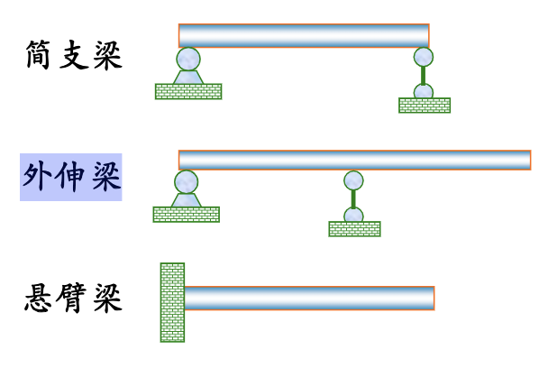

## 知识点

| 名词      | 备注                             | 相关公式        |
| ------- | ------------------------------ | ----------- |

## 考点

| 考点         | 备注                                    |
| ---------- | ------------------------------------- |
| 剪力和弯矩正负号规定 | 剪力： 使杆件截开部分产生顺时针转动为正 弯矩： 使梁段向下凸起为正 |

## 课后习题

| 编号   | 内容             | 情况         | 方法           |
| ---- | -------------- | ---------- | ------------ |
| 12.1 | 求指定截面的剪力和弯矩    |            | 主要是搞清楚正负号的分辨 |
| 12.2 | 剪力和弯矩方程，剪力和弯矩图 | 我认为应该自己做一遍 |              |
| 12.3 | 剪力和弯矩图         | 我认为应该自己做一遍 |              |
| 12.4 | 叠加法作弯矩图        |            |              |
| 12.5 |                |            |              |
| 12.6 |                |            |              |
| 12.7 |                |            |              |

# 12.平面弯曲内力

## 12.1 概述

> 以弯曲为主要变形的杆，通常称为梁。

通常，梁用其轴线表示,根据支座的简化情况，可以得到 3 种基本形式的梁:

## 12.2 剪力和弯矩图

**正负号规定**

-   剪力： 使杆件截开部分产生**顺时针**转动为正
-   弯矩： 使梁段**向下凸起**为正

**分析过程**

1. 确定支承反力
    - 通过力矩平衡以及内力平衡的关系计算
2. 剪力方程与弯矩方程
3. 剪力图与弯矩图
