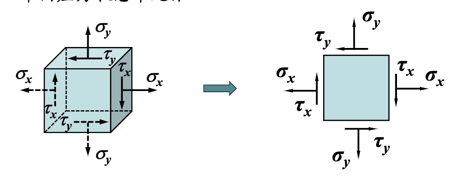
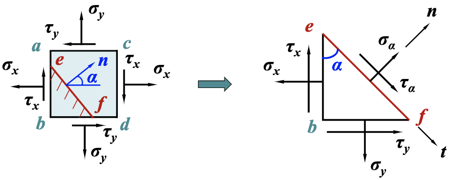

# 应力应变状态分析

## 1. 应力状态的概念

## 2. 平面应力分析

**符号规定**

| 力     | symbol     | +                            | -      |
| ------ | ---------- | ---------------------------- | ------ |
| 正应力 | $$\tau$$   | 拉                           | 压     |
| 切应力 | $$\sigma$$ | 顺指针                       | 逆时针 |
| 方位角 | $$\alpha$$ | x 正向逆时针转至外法线方向 n | 反之   |

### 2.1 任意方向面上的应力

