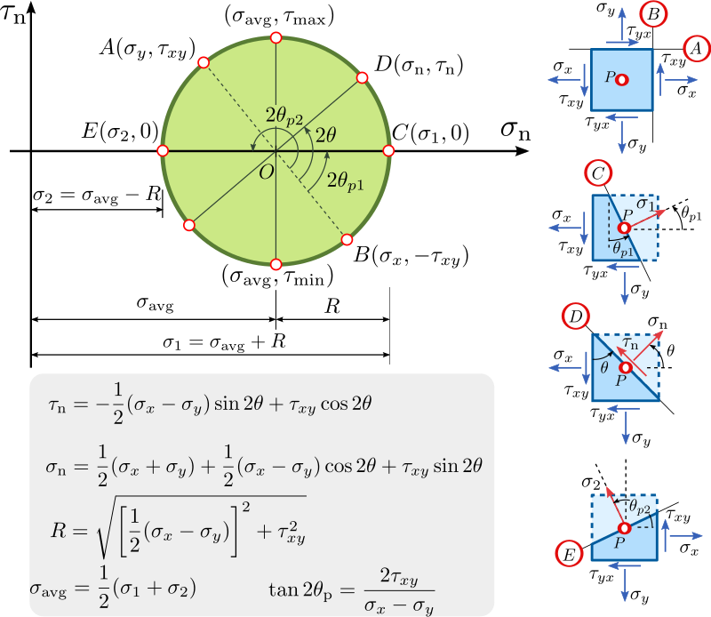
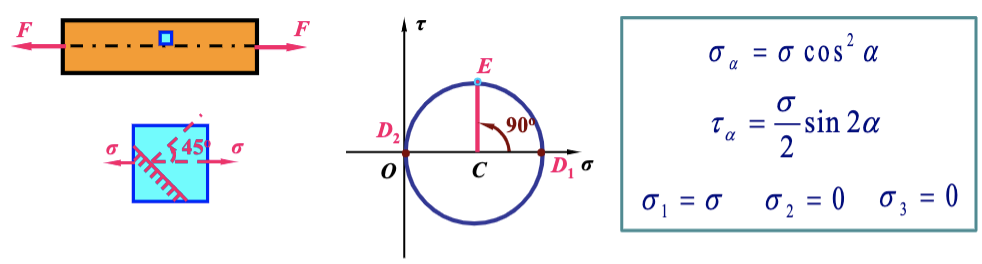
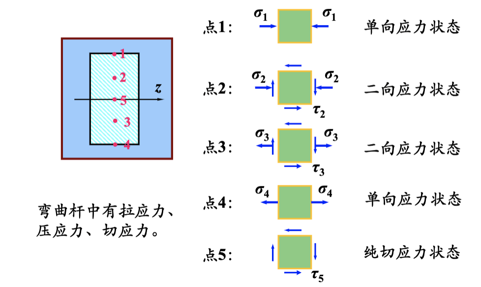
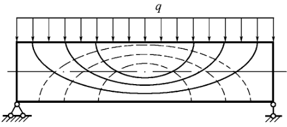

# 应力应变状态分析

主要目标：

1. 研究任意截面上的应力

## 1. 应力状态的概念

-   **应力状态**：一点处各方向面上应力情况的集合
-   **单元体**：围绕一点取一无限小的长方体
    -   单元体每个面上的应力都是**均匀分布**的
    -   **相互平行的一对面上**的应力大小相等，符号相同
-   **主平面**：三个相互垂直的，只有正应力没有切应力的方向面。
-   **主应力**：主平面上的正应力。

> 只要知道某点处任取的单元体各面上的应力，就可以求得该单元体其它所有方向面上的应力，该点的应力状态也就完全确定。

### 1.1 应力状态分类

-   单向应力状态：一个主应力不为零
-   二向应力状态：两个主应力不为零
-   三向应力状态：三个主应力不为零
-   纯切应力状态：只有切应力，没有正应力

## 2. 平面应力分析

**符号规定**

| 力     | symbol     | +                            | -      |
| ------ | ---------- | ---------------------------- | ------ |
| 正应力 | $$\tau$$   | 拉                           | 压     |
| 切应力 | $$\sigma$$ | 顺指针                       | 逆时针 |
| 方位角 | $$\alpha$$ | x 正向逆时针转至外法线方向 n | 反之   |

### 2.1 任意方向面上的应力

**平面应力状态下任意方向面上正应力和切应力的计算公式**:

$$\sigma_{\alpha}=\frac{\sigma_x+\sigma_y}{2}+\frac{\sigma_x-\sigma_y}{2}\cos 2\alpha-\tau_x\sin2\alpha$$

$$\tau_{\alpha}=\frac{\sigma_x-\sigma_y}{2}sin2\alpha+\tau_xcos2\alpha$$

**任意两个互相垂直方向面上的正应力之和为常数，切应力服从切应力互等定理**

$$\sigma_{\alpha}+\sigma_{\alpha+90\degree}=\sigma_x+\sigma_y$$

$$\tau_{\alpha}=-\tau_{\alpha}$$

### 2.2 应力圆

> 莫尔圆（Mohr's circle）得名自德国土木工程师克里斯汀·奥图·莫尔，是一种用二维方式表示柯西应力张量转换关系的图。

通过平面应力状态下任意方向面上正应力和切应力的计算公式可以计算出在任意方向的截面上的应力关系

$$
(\sigma_{\alpha}-\frac{\sigma_x+\sigma_y}{2})^2+\tau_{\alpha}^2
= (\frac{\sigma_x-\sigma_y}{2})^2+\tau_x^2
$$

可以看出圆心在
$$(\frac{\sigma_x+\sigma_y}{2},0)$$

半径为
$$\sqrt{(\frac{\sigma_x-\sigma_y}{2})^2+\tau_x^2}$$

在平面应力状态下，一点的应力状态与该点的应力圆对应，圆周上的一点与该点的某个方向面对应

**注意事项**

1. 点面对应：应力圆上的一个点对应一个方向面
2. 正负号对应
3. 起始半径与坐标轴对应：
4. 2 倍角对应:在单元体上，方向面的角度为 α 时，在应力圆上则自起始半径转动 2α 角，并且它们的转向应一致

### 2.3 主平面和主应力

-   **主平面**：切应力为零的方向面
-   **主应力**：主平面上的正应力

由应力圆求主应力：即两个与 x 轴相交的点
主平面的方向：即起始平面与 x 轴夹角的二分之一

## 3. **基本变形杆件**的应力状态分析

### 3.1 拉压杆件应力状态分析

### 3.2 扭转杆件应力状态分析

### 3.3 梁的应力状态分析

### 3.4 主应力轨迹线的概念

-   主应力轨迹线是两组**正交**的曲线
-   其中一组曲线是**主拉应力**轨迹线，在这些曲线上，每点的切线方向表示该点的主拉应力方向；
-   另一组曲线是**主压应力**轨迹线，在这些曲线上，每点的切线方向表示该点的主压应力方向。
-   **中性层**处（纯切应力状态）主应力轨迹线与轴线夹 45° 角。

## 4. 三向应力状态分析

就是画三个二位的应力圆，他们会互相相切，就是三向的了。

## 5. 广义胡克定律


**泊松比**:而其横向应变与纵向应变的比率
当材料在一个方向被压缩，它会在与该方向垂直的另外两个方向伸长，这就是泊松现象，泊松比是用来反映泊松现象的无量纲的物理量。


我们考虑$$\sigma_1$$方向上的应变：
那么要考虑的有$$\sigma_1$$上的：$$\epsilon_1'=\frac{\sigma_1}{E}$$
还有$$\sigma_1,\sigma_2$$加在这个方向上的应变：$$\epsilon=-v\frac{\sigma}{E}$$,这里的 v 是泊松比。

所以$$\sigma_1=\frac{1}{E}[\sigma_1-v(\sigma_2+\sigma_2)]$$
