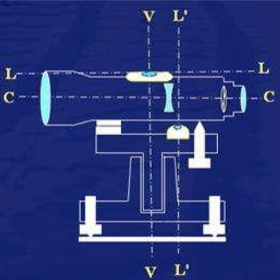
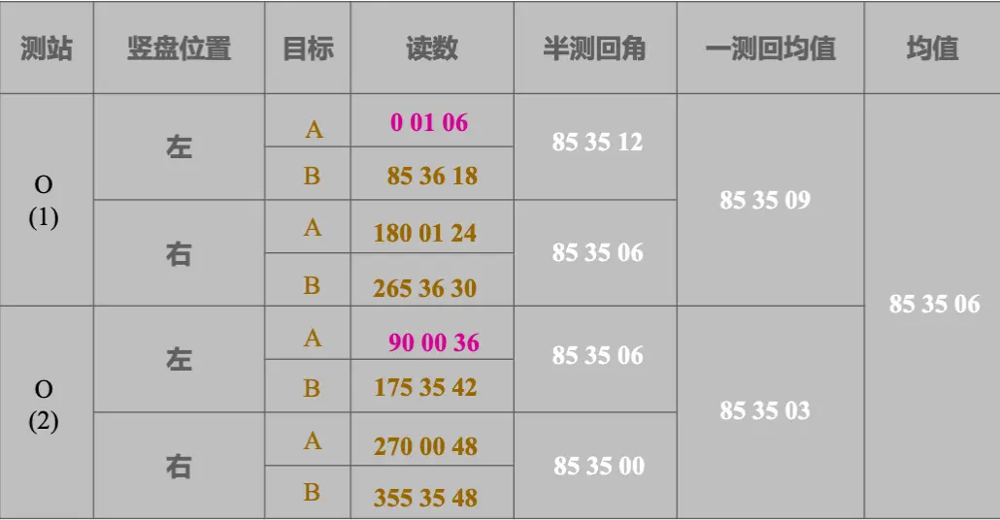
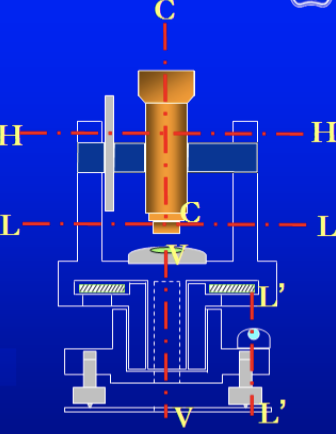
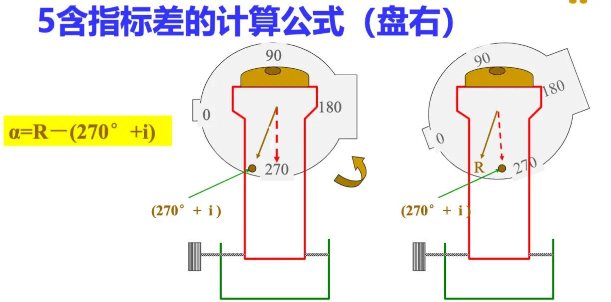
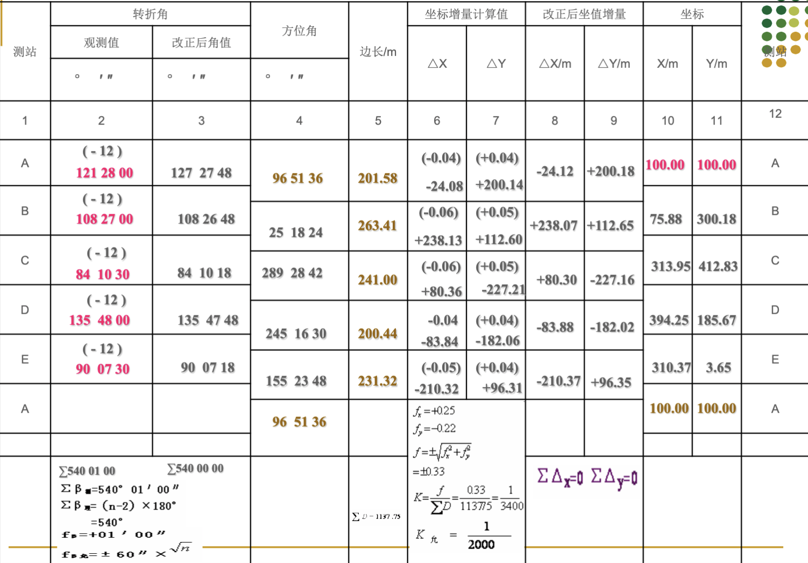
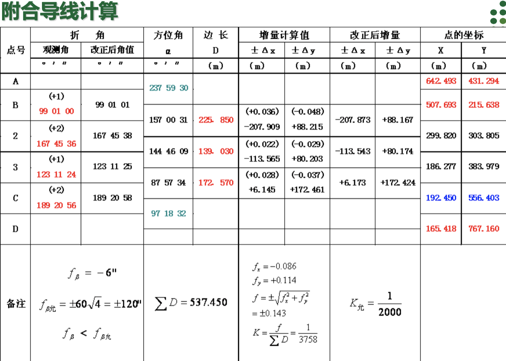
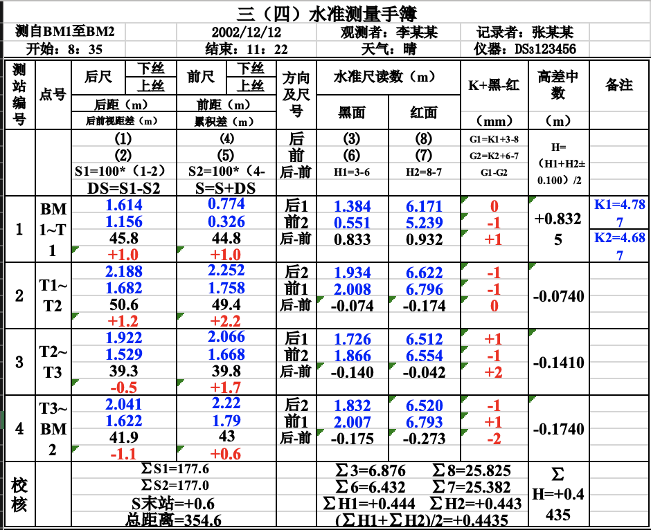

# 试卷题型

---

**题型**

-   选择 10 题 20 分
-   填空 12 题 24 分
-   简答 3 题 22 分
-   计算 3 题 34 分

# 一、绪论

---

## 1.测量学定义和任务、测量内外业的基准面和基准线

-   测量学定义
    -   它是研究地球的形状、大小以及地球表面各种形态的科学
    -   概括：确定空间点的位置及其属性关系。
-   任务
    -   确定地球的形状和大小，为地球科学提供必要的数据 和资料；
    -   将地球表面的地物地貌测绘成图；
    -   将图纸上的设计成果测设至现场。
-   **测量内外业的基准面和基准线**
    -   内业
        -   基准面：参考椭球面
        -   基准线：法线
    -   外业
        -   基准面：大地水准面
        -   基准线：铅垂线

## 2.点位的表达方式：坐标和高程，高斯直角坐标系，平面直角坐标，绝对高程，相对高程

-   坐标和高程
    -   高程
        -   绝对高程（即海拔）
        -   相对高程
-   高斯平面直角坐标系

> [!IMPORTANT]
> 6 度带的起点是 0
> 3 度带的起点是-3

> [!IMPORTANT]
> 已知某点大地经度为 126 度 36 分，问该点各位于 6 度带和 3 度 带的那一带上？
>
> **6 度带**：N= L/6（取整）+ 1 = 126.6/6 （取整） +1 = 22 度带
> **3 度带**：N= L/3（四舍五入）=126.6/3（四舍五入）=42.2=42 度带

-   平面直角坐标系：是数学坐标系的逆时针

## 3.测量的三个基本工作

-   距离测量——斜距、平距（ $D_{PA} D_{AB}$ ）
-   角度测量——水平角、竖直角（$α_{PA}$ β ）
-   高程测量（ $h_{PA} h_{AB}$ ）

## 4.测量的基本原则

-   布局上：由整体到局部
-   精度上：由高级到低级
-   次序上：先控制后细部

## 5. 基本观测量

-   距离
-   角度
-   高差

# 二、水准测量

---

## 1.水准测量的基本原理（中间法，连续中间法）

利用水准仪提供水平视线，借助水准尺来测定地面上两点的高差，从而由已知点高程推出未知点的高程。

-   中间法
    -   高差法
    -   视线高法

$$h_{AB}=H_A-H_B$$

## 2.水准仪在一个测站上的使用步骤（视差产生和消除）

-   水准仪的精度划分等级
    -   精密的：DS05>DS1
    -   普通的：DS3>DS10

D—大地测量；S—水准仪;**后面的数字代表仪器的测量精度**（每公里往返测高差中数的中误差，即精度,单位:mm）

-   水准仪的主要几何轴线及其关系
    -   圆水准轴 L'L'
    -   长水准管轴 LL
    -   视准轴 CC
    -   竖轴 VV

1. 安置三脚架和水准仪
2. 使用圆水准器气泡居中
3. 粗瞄和精瞄，消除视差
4. 使长水准管气泡居中
5. 用中丝读数

> [!IMPORTANT]
> 视差的定义：当观测时把眼睛稍作上下移动，如果尺像与十字丝有相对的移动，即读数有改变，这一现象叫视差
> 视差原因：目标成像平面与十字丝平面不重合
> 消除方法：首先转动目镜调焦螺旋使十字丝清晰，转动望远镜瞄准水准尺，再转动物 镜调焦螺旋使目标清晰。反复交替调节目镜和物镜对光螺旋，直到不再出 现尺像和十字丝有相对移动为止。

## 3. 测站校核和路线校核

-   测站校核
    -   两次仪器高法：改变仪器高度约 10cm，再次测定高差
    -   双面尺法：用双面水准尺的黑面和红 面两次测定高差
    -   **两次测得高差之差**未超过 5mm（四等水准）
-   路线检核 (成果检核)
    -   实际测量得到的该段高差与该段高差的==理论==值之差称为==高差闭合差==，用$$f_h$$表示。
    -   附合水准路线： $$\sum h_理= H_终 -H_始$$ $$f_h = ∑h_测-(H_终-H_始)$$
    -   闭合水准路线： $$\sum h_理A=0$$ $$f_h = ∑h_测$$
    -   支水准路线： $$f_h = ∑h_往- ∑h_返$$

## 4.水准的外业测量+内业计算（闭合路线&附和路线）

-   外业测量

-   内业计算
    1. 计算高差闭合差和允许闭合差
    2. 计算高差改正数
       $$\sigma_i = - \frac{f_h × L_i}{ [L]}$$
       $$\sigma_i = - \frac{f_h × n_i}{[n]}$$
    3. 计算改正后高差
    4. 计算各点高程

## 5.水准测量的误差

-   仪器误差
    -   i 角误差-前后视距尽量相等
    -   调焦误差-前后视距尽量相等
    -   水准尺零点误差-每个测段安排成偶数站
-   观测误差
    -   整平误差-视线不要太长
    -   照准误差-视线不要太长
    -   估读误差-视线不要太长
    -   水准尺倾斜误差-安置圆水准器
-   外界条件影响
    -   仪器垂直位移-后前前后
    -   尺垫垂直位移-往返观测
    -   地球曲率-前后视距尽量相等
    -   大气垂直折光-前后视距尽量相等

# 三、角度测量

---

| 关键名词 | 备注                                           |
| -------- | ---------------------------------------------- |
| 水平角   | 地面上两相交直线的夹角在水平面上的投影         |
| 竖直角   | 在同一垂直面内，倾斜视线与水平线之间的夹角     |
| 指标差   | 竖盘指标水准管气泡居中时竖盘读数与理想读数的差 |

## 1.水平角测量原理

-   地面上两相交直线的夹角在水平面上的投影。
-   圆盘中心必须处于角顶点的**铅垂线**上

## 2.测回法（多测回）、全站仪的安置

-   全站仪的安置

    -   对中：使得度盘中心处于角顶点的铅垂线上。也就是使仪器的中心与测站点的 标志中心在同一铅垂线上。 （垂球对中…，对中器对中…）
    -   粗略对中：移动三脚架，使垂球尖离测站中心 1 ～ 2cm 内；
    -   精确对中：稍微松开中心螺丝，在脚架头上移动仪器，使垂球尖精确对中测站 标志中心，旋紧中心螺丝。
    -   整平：使仪器纵轴铅垂，水平度盘与横轴水平，竖盘位于铅垂面内
    -   粗平—保持架腿位置不变,然后松脚架的螺丝,十架腿伸 长或者缩短,同时观察水准汽泡,最后使汽泡位于圆水准器 的小圆圈内
    -   精平—放松水平制动螺旋,使照准部水准管与任意 1,2 两个脚螺 旋连线平行,使水准汽泡居中,然后将照准部旋转 90 度,转动脚 螺旋 3,再次使水准管汽泡居中.如此反复多次,直至在任何位置, 水准汽泡都居中。
    -   瞄准

> -   测回法
>     -   适用于观测两个方向之间的单角
> -   盘左/盘右
>     -   盘左/正镜:竖盘在望远镜的左边
>     -   盘右/倒镜:竖盘在望远镜的右边
> -   配盘
>     -   旋转到指定角度后锁定，瞄准 目标后再解锁，完成配盘

-   测回法
    -   上半测回：$$ß_左=b_左-a_左$$
        -   **盘左**位置，瞄准左边目标 A。配置度盘在 0 或稍大 0 度，读数$a_左$记于手簿
        -   **顺时针**旋转望远镜，瞄准右边的目标 B 点，读数$b_左$ 记于手簿
    -   下半测回：$$ß_左=b_左-a_左$$
        -   倒转望远镜，**盘右**位置，逆时针旋转照准部，瞄准右边 B 点，记录读数
        -   **逆时针**旋转照准部，瞄准左边的目标 A 点，记录读数
    -   最终取平均值

-   全站仪的几何轴线

## 3.竖直角测量原理及指标差的计算

-   竖直角通过观测倾斜视线与水平线在竖直度盘上的读数从而求出竖直角的大小
-   不过水平线在竖盘上的读数为固定读数，只需读取倾斜视线的读数（可变的），便可 获得两读数之差
-   竖盘构造

-   竖直角计算公式推导
    -   盘左
    -   盘右
-   竖盘的指标差
    -   竖盘指标水准管气泡居中时 竖盘读数与理想读数的差

# 四、距离测量

---

## 1. 钢尺测距

-   工具
    -   钢尺
        -   端点尺
        -   刻线尺
-   直线定线：在地面上标定出位于同一直线上的 若干点，以便分段丈量。
    -   目视定线
    -   经纬仪定线
-   钢尺量距的一般方法
    -   平地量距
    -   斜坡量距
-   记录方法&精度
    $$K=(D_往-D_返)/D_平=1/M$$
    平坦地区：$$K=1/3000$$
    困难地区：$$1/1000$$

## 2. 视距测量方式和公式

-   视距测量：使用带有**视距丝**的仪器间接地同时测定地面上两点间的**距离**和**高差**的方法。
-   原理
    -   实现水平时：水准仪
        -   视距：$$D_{ab}=100|a-b|$$
        -   高差：$$H_B=H_A+i-l$$
    -   实现倾斜时：经纬仪
        -   视距：$$D=100ncos^2\alpha$$
        -   高差：$$h=Dtan\alpha+i-l$$

## 3. 光电测距的原理

$$D = \frac{1}{2}c \cdot t  = \frac{1}{2}(N\lambda+\Delta\lambda)$$

# 六、控制测量

---

控制测量的任务：

-   目的：提供控制基础和起算基准。
-   实质：测定控制点的平面坐标和高程。

## 1. 直线定向、方位角、坐标正算反算

-   直线定向：确定直线与标准方向之间水平夹角的工作
    -   标准方向：
-   方位角：从直线一端的标准方向开始顺时针量至该直线的水平夹角。其取值范围 0° ～ 360º 。
    -   真方位角：过真子午线的切线方向
    -   磁方位角：过磁子午线的切线方向
    -   坐标方位角：中央子午线的方向
-   **坐标方位角：从直线一端的坐标北方向开始顺时针至该直线的水平角**
    -   坐标方位角的推算
    -   左角右角：前进方向左边称左角，前进方向右边称右角

-   坐标正反算
    -   正算：已知 A 点的坐标方位角和距离，求 B 点的坐标
    -   反算：已知 A 点的坐标和 B 点的坐标，求距离和方位角

## 2. 导线测量（闭合、附合、支）、外业工作（选点、测角和测距）、内业计算坐标

### 导线测量

-   **导线的基本形式**
    -   闭合导线：
    -   附合导线：
    -   支导线：
    -   导线网：

### **导线的外业工作**

-   选点
-   观测
    -   水平角
    -   距离

### 导线的内业计算

1. 计算前的准备工作
2. 内业计算目的
    - 利用已知数据和外业观测成果,计算导线点的平面直角坐标（X，Y）
    - 评价观测质量是否合格
3. 闭合导线点的坐标计算
    1. 角度闭合差计算和调整
    2. 导线边方位角计算
    3. 坐标增量计算及坐标增量闭合差调整
    4. 坐标计算

下面是一张示范的表格，考试很可能会考到这个表格：

## 3. 四等水准测量（双面尺观测法）

### 技术指标

$$\pm 20\sqrt{L}  \pm 6\sqrt{n}$$

### 测站的观测顺序

### 观测内容

### 计算与检核

# 七、 GPS 测量

## 1. 四大全球定位系统

美国的 GPS
俄罗斯的 GLONASS
欧盟的 Galileo 系统
中国的 Compass(北斗)

## 2. 绝对定位及其基本原理

-   绝对定位（单点定位）：在地球协议坐标系中，确定观测站相对地球质心的位置。

    -   基本原理：以 GPS 卫星和用户接收机天线之间距离（或距离差）的观测量为基础，并根据已知的卫星瞬时坐标来确定用户接收机天线所对应的点位，即观测站的位置。
    -   绝对定位的实质：空间距离后方交会。

## 3. 相对定位原理

-   相对定位：在地球协议坐标系中，确定观测站与地面某一参考点之间的相对位置。
    -   利用两台接收机分别安置在基线的两端，同步观测相同的 GPS 卫星，以确定基线端点的相对位置或基线向量。

# 八、 测图

## 1. 地形图、比例尺、比例尺精度

-   地形图：按一定的比例尺，用规定的符号表示的地物、地貌平面位置和高程的正射投影图
-   比例尺：地形图上任意一线段的长度与地面上相应线段的实际水平长度之比
-   比例尺的精度：由于人眼最小视角的限制, 正常眼睛的分辨能力通常认为是 0.1mm, 因此, 地形图上 0.1mm 所代表的实地长度
    -   计算：1mm ✖️ 比例
-   图幅类型
    -   图幅类型：40×40、40×50、50×50
    -   标准图幅： 50cm×50cm
    -   1 km2 图幅数：1：500（16 幅），1：1000（4 幅）

## 2. 地物的表示符号：三种

-   比例符号
-   非比例符号
-   半比例符号

## 3. 地貌表示符号：等高线

-   等高线：地面上高程相等的相邻各点所连的闭合曲线。
-   等高线的几个概念
    -   **等高距 h——两相邻等高线之间的高差。**
    -   **等高线平距 D——相邻两等高线的水平距离。**
    -   **坡度**： i
    -   三者的关系: i=h/D
-   等高线的种类
    -   基本等高线（首曲线）—地图上按规定等高距勾绘的等高线
    -   计曲线——为了便于计数每隔 5 个等高距画一根加粗的等高线
    -   半曲线（间曲线）——为了较好地表示局部地区地形的细部，以等高距的一半用虚线加绘的等高线
    -   辅助曲线——为了更好地表示局部地区地形的细部，以任意高程用短虚线加绘的等高线
-   特性
    （1）同一条等高线上, 各点的高程必相等。
    （2）等高线是闭合曲线, 如不在同一图幅内闭合则必在图外或其它图幅中闭合。
    （3）不同高程的等高线不能相交。但某些特殊地貌, 如陡崖等是用特定符号表示其相交或重叠的。
    （4）一幅地形图上等高距相等。等高线平距小, 表示坡度陡 ,平距大则坡度缓, 平距相等则坡度相同。
    （5） 等高线与山脊线、山谷线成正交。

## 4. 等高线的勾绘(给定等高距)

## 5. 全站测图法实施与计算方法
